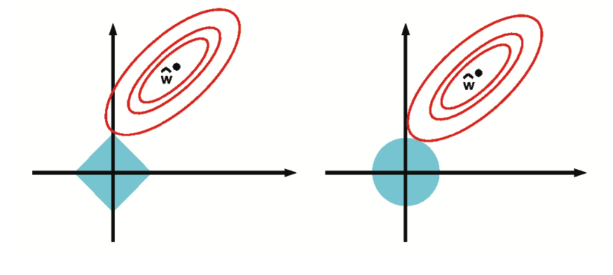

# L1 regularization sparse solution

We can write the [objective](l1_regularization.md) function:

$$
\min_w RSS(w) + \lambda ||w||_1
$$
as a constraned but smooth (quadratic function with linear constraints):

$$ min_w RSS(w) \\ \text{s.t}  \\ ||w||_1 \le B$$

* $B$ is an upperbound on the $l_1$ norm of the weights

This form is allso known as the **lasso** which stants for **least absolute shrinkage and selection operator**.

If we compare it to ridge regression:

$$\min_w RSS(w) \\ \text{s.t.} \\||w||_2^2 \le B$$

And plot the contours of the $l_1$ and $l_2$ constraint surface: 

From the theory of constrained optimization, we known that the optimal solution occurs at the point where the lowest level set of the ojbective function intersects the constraint surface. Hence as we relax the constrained B, we grow $l_1$ ball until  until it meets the objective; the corners of the ball are more likely to intersect the ellipse than one of the sides, especially in high dimensions, because the corners “stick out” more. The corners correspond to sparse solutions, which lie on the coordinate axes. By contrast, when we grow the $l_2$  ball, it can intersect the objective at any point; there are no “corners”, so there is no preference for sparsity

We can also compare two possible solution:

$$
w_1 = (1,0) \\
w_2 = (1/\sqrt{2}, 1/\sqrt{2})
$$

Now $w_1$ is obviously sparse and $w_2$ is not but if we compare the $l_1$ and $l_2$ norms we get:

The $l_2$ norm
$$
||(1,0)||_2 = ||(1/\sqrt{2}, 1/\sqrt{2})||_2 1
$$

The $l_1$ norm:

$$
||(1,0)||_1 = 1 < ||(1/\sqrt{2}, 1/\sqrt{2})||_1 = \sqrt{2}
$$
