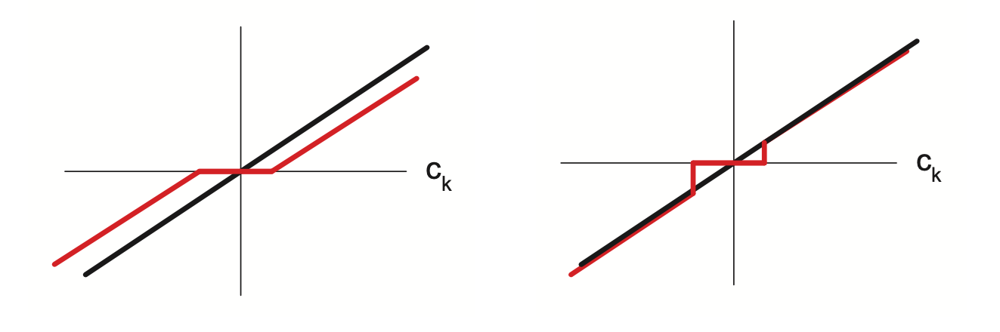

# Optimality conditions for the lasso

The lasso objective has the form:

$$f(\theta) = RSS(\theta) + \lambda ||w||_1 $$

Unfortunatelly the $l_1$ norm not differentiable. Because of this we have to use [subgradients](subgradients.md)

For the function $f(\theta) = |\theta|$  (absolute value) the subgradient is given by:

$$
\nabla f(\theta) \begin{cases}
    {-1} & \text{ if } \theta < 0 \\
    [-1, 1] & \text { if } \theta = 0 \\
    {+1} & \text{ if } \theta > 0 
\end{cases}
$$

To find the gradient we first differentiate $RSS(\theta)$

$$
    \frac{\partial}{\partial w_j} RSS(W) = a_j w_j - c_j
$$

* $a_j = 2\sum_i^n x^2_{ij}$
* $w_{-j}$ is w without feature j
* $x_{i, -j}$ is the i th component of x without feature j
* $c_j = 2 \sum_i^n x_{ij} (y_i - w^T_{-j}x_{i, -j})$ 
  * is the correlation between the $j$ th feature $x_{:,j}$ and the residual due the other features, $r_{-j}= y - X_{:,-j} w_{-j}$.
  *  magnitude of $c_j$ is an indication of how relevant the feature j is. 

If we add the subderivative to the penalty we get:

$$
\nabla_{w_j}f(w) = (a_j w_j - c_j) + \lambda_{w_j} ||w||_j \\
= \begin{cases}
    \{  a_j w_j - c_j - \lambda \} & \text { if } w_j < 0 \\
    [-c_j - \lambda, -c_j + \lambda] & \text { if } w_j = 0 \\
    \{ a_j w_j - c_j + \lambda \} & \text{ if } w_j > 0
\end{cases} \\
$$

Or:

$$
X^T(Xw - y)_j \in \begin{cases}
    \{ - \lambda \} \text{ if } w_j < 0 \\
    [-\lambda, \lambda] \text{ if } w_j = 0 \\
    \{\lambda\} \text{ if } w_j > 0
\end{cases}
$$

Depending on the value of $c_j$, the solution to $\partial_{w_j} f(w)  = 0$ can occur at 3 different values:
1. $c_j \le -\lambda$ the feature is strongly negatively correlated with the residual the subgradient is zero when $w_j = \frac{c_j + \lambda}{a_j} < 0$ 
2. $c_j \in [-\lambda, \lambda]$ feautre is weakly correlated with the residual the subradient is zero at $\hat{w}_j = 0$
3. $c_j > \lambda$ the feature is storngly correlated with the residual, subgradient is zero at $\hat{w}_j = \frac{c_j - \lambda}{a_j} > 0$

We can express $w_j$ as:

$$\hat{w}_j = soft(\frac{c_j}{a_j}; \frac{\lambda}{a_j}) $$

* soft is the [soft-treshold function](soft_thresholding.md) 

This procedure is called soft thresholding:

Here the bold black line prepresents the unregularized fit, and the red line the soft thresholded. In soft thresholding $\hat{w}_j = 0$ if $-\lambda \le c_j \le \lambda$. Also large values are shunken, and smaller are made larger, (**lasso** stands for *least absolute selection and shrinkage operator*) name) hence this makes **lasso a biased estimator**, since in general we do not want to shrink large values.

## Maximal value of $\lambda_{max}$

$$ \lambda_{max} =  ||X^Ty||_{\infty} = max_j |y^Tx_{:,j}|$$

If we set $\lambda > \lambda_{max}$ we will get $\hat{w} = 0$