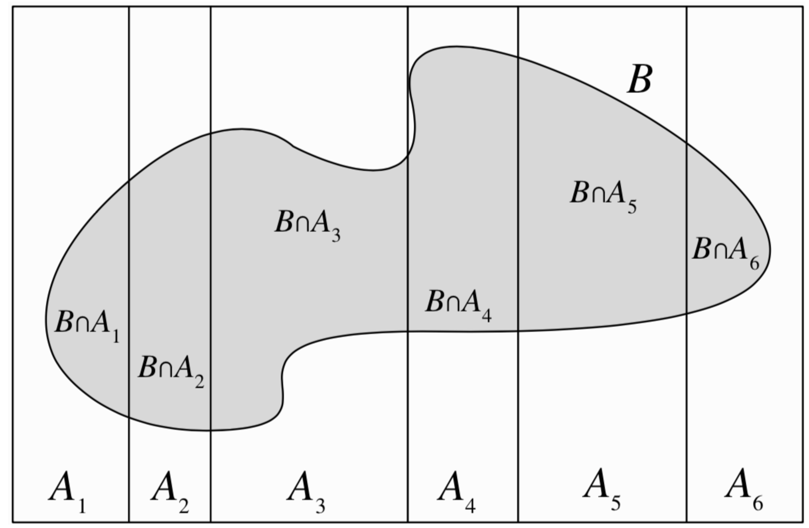

# Law of total Probability

We define a partition $A_1, A_2, \cdots, A_n$ on the sample space S, ($A_i$ are disjoint and their union is S), with probability $P(A_i) \ge 0$ for all i then:

$$P(B) = \sum_{i=1}^n P(B|A_i)P(A_i)$$

this comes from the fact that $A_i$ form a partition on S, we can decompose B as:

$$B = (B \cap A_1) \cup (B \cap A_2)  \cup \cdots \cup (B \cap A_n)$$ 

And visualy it looks as follows:

## Conditional Law of total Probability
Let $A_1, _2, \cdots, A_n$ for a partition on the sample space S. Provided that an event E has happend and $P(A_i \cap E) > 0$ for all i we have
$$P(B|E) = \sum_{i=1}^n P(B|A_i,E)P(A_i|E)$$

