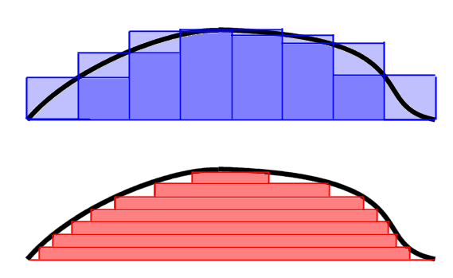

# Lebesgue integral
* extends the idea of Riemann sum interpretation of an integral
* we use horizontal stabs (not necessarily rectangular) instead of verticals
* enables us a broader class of functions

## Intuition

* the first is the Riemann integral
* the red is Lebesgue integral

[wiki](https://en.wikipedia.org/wiki/Lebesgue_integration)