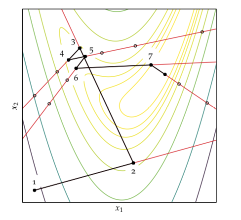

# Line search 
Lets assume we have already chosen the [descent direction](local_descent.md) $d$. And we want to choose the step factor $\alpha$ to choose the next design point. One approach is to use line search, which select the step factor that minimizes:

$$
\min_{\alpha} f(x + \alpha d)
$$

This can be achieved using any univariate optimization. However this is expensive to perform at each iteration. Instead we find an reasonable $\alpha^{(k)}$ and move on.

Some algorithms use fixed step factor. Here however is a risk that we overshoot the minimum or that convergence will be slow. 
Another common approach is to select a decaying step factor:

$$
\alpha^{(k)} = \alpha^{(1)}\gamma^{(k^-1)} \; \gamma \in [0,1]
$$

Decaying step factors are especially usefull when minimizing a noisy objective function. (Typical in ML).

## Approximate Line search
Approximate line search tries to find a suitable step size in a small number of steps. In a descent method any value of $\alpha$ that will cause a decrease in the objective function is good. However if we enforce a variety of condition we may achieve faster convergence. A condition of [sufficient decrease](wolfe_conditions.md) (Armijo condition or First Wolfe) requires that the step sizes causes a sufficient decrease in the objective function:

$$
f(x^{(k+1)} ) \le f(x^{(k)}) + \beta \alpha \nabla_{d^{(k)}}f(x^{(k)})
$$
* $\beta \in [0,1]$ often set to $\beta = 10^{-4}$. If we set $\beta = 0$ then we accept any decrease. If $\beta = 1$ than the decrease has to be at least as much as what would be predicted by a first order approximation.
* $\nabla_{d^{(k)}}$ is the gradietn of $f$ at $x^{(k)}$

### Algorithm for Backtracking line Search
Start with a large value of $\alpha$
We require: $f, \nabla f, x, d \alpha, p=0.5, \beta = 1e^{-4}$

> $y, g = f(x), \nabla f(x)$
> 
> while $f(x + \alpha d) > y + \beta \alpha (g \cdot d) \\ \; \; \; \; \alpha = \alpha p$
> 
> return $\alpha$

Here we try to accecpt the largest possible step.

The black lines show the iterations taken by the descent method, and red lines show the points considered during each line search.