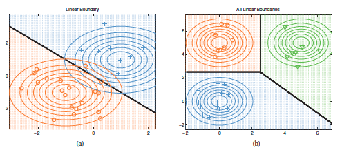

# Linear discriminant analysis
It is Gaussian model for classification that is similar to Quadratic [discriminant analysis](quadratic_distriminant_analysis.md) where we assume Gaussian distribution for each class, but instead of having specific covariacne matrix for each class $\Sigma_c$  we defined an shared covariance matrix $\Sigma$.

$$p(y=c|x, \theta) \propto \pi_c \exp {[\mu_c^T \Sigma^{-1}x - \frac{1}{2} x^T \Sigma^{-1}x - \frac{1}{2} \mu_c^T \Sigma^{-1}\mu_c] } $$

$$p(y=c|x, \theta) \propto \exp {[\mu_c^T \Sigma^{-1}x - \frac{1}{2} \mu_c^T \Sigma^{-1}\mu_c + \log \pi_c]}\exp{ [- \frac{1}{2} x^T \Sigma^{-1}x ]}$$

The quadratic form:

$$ x^T \Sigma^{-1}x $$ 

is class independent, and it will cancel out the denominator if we define:

$$ \gamma_c =  -\frac{1}{2} \mu_c^T \Sigma^{-1}\mu_c + \log \pi_c$$

$$\beta_c = \Sigma^{-1}\mu_c $$

Hence we get:

$$ p(y = c| x, \Sigma) = \frac{e^{\beta^T_c x + \gamma_c}}{\sum_{c} e^{\beta^T_{c'} + \gamma_{c'}}} = \mathcal{S}(\eta)_c$$

Where:
* $\eta = [B^T_1x + \gamma_1, \cdots, B^T_C x + \gamma_c]$
* $\mathcal{S}$ is the [softmax function](softmax_function.md) 

For detailed derivation [from QDA to LDA](quadratic_to_linear_discriminant_analysis.md)

In the context of LDA, if we would take the log of the softmax function we would get a linear function, thus this makes the decision boundary linear. 

## MLE
If we maximize the log likelihood we get:

$$\hat{\mu}_c = \frac{1}{N_c} \sum_{i: y_i = c} x_i$$
$$\hat{\Sigma}_c = \frac{1}{N_c} \sum_{i: y_i = c} (x_i - \hat{\mu_c})(x_i - \hat{\mu_c})^T$$

$$\hat{\pi_c} = \frac{N_c}{N}$$

# Regularization

Mle tends to be ill conditioned  (covariance matrix is singular) in high dimensional settings, thus we have to introduce some mechanism to avoid overfitting.

## Regularization

We perform MAP estimation on $\Sigma$ using a inverse Wishart Prior of the from $IW(diag (\hat{\Sigma}_{MLE}), v_0)$ hence we have:

$$ \hat{\Sigma} = \lambda \text{diag}(\hat{\Sigma}_{MLE}) + (1 - \lambda) \hat{\Sigma}_{MLE}$$

Where:
* $\lambda$ control the amounth of regularizaton.

$$\hat{\Sigma}_{MLE} = V (\frac{1}{N} Z^TZ  - \mu \mu^T)V^T \\ X = UDV^T \\ Z = UD$$

* $X$ is the design matrix

It is impossible to compute $\hat{\Sigma}_{MLE}$ if $D > N$, (Wide short matrix). But we can use SVD of X.

$X = UDV^T$ 

## Diagonal LDA

If we use regularized LDA but we set $\lambda = 1$ then we get a special variant called **Diagonal LDA**
