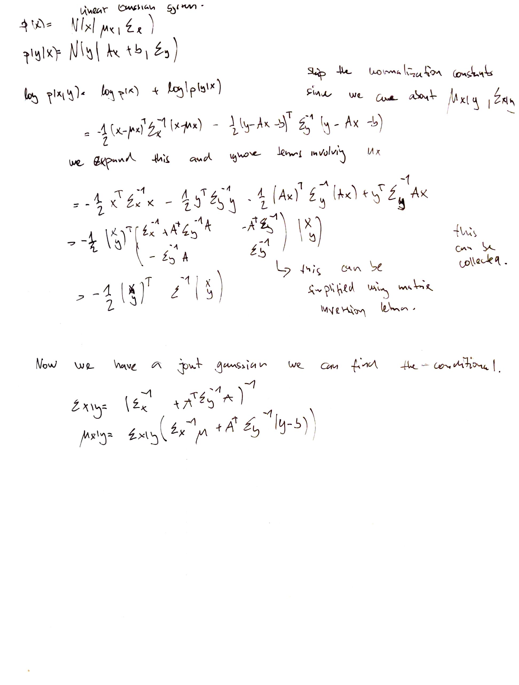

----
source:
- Machine Learning An Probabilistic Perspective

tags:
- Machine Learning
----

# Linear Gaussian systems
We have 2 variables $x,y$. Let $x \in R^{D_x}$ be a hidden variable and, $y \in R^{D_y}$ be a noisy observation of x. Let us assume we have the following prior and likelihood:

$$p(x) = \mathcal{N}(x| \mu_x, \Sigma_x) $$
$$p(y|x) = \mathcal{N}(y| Ax + b, \Sigma_y) $$

Where:

* $A$ is a matrix of size $D_y \times D_x$. This is an example of a linear Gaussian system $x \rightarrow y$ meaning x generates y. And we want to study how to invert this arrow, to find out abouty x given we observed some y. 

Posterior $p(x|y)$ is given by:

$$p(x|y) = \mathcal{N}(x| \mu_{x|y}, \Sigma_{x|y})$$
$$\Sigma_{x|y}^{-1} = \Sigma_x^{-1} + A^T\Sigma_y^{-1}A$$
$$\mu_{x|y} = \Sigma_{x|y}[A^T\Sigma_{y}^{-1} (y-b) + \Sigma_x^{-1}\mu_x]$$

Normalization constant:

$$p(y) = \mathcal{N}(y| A\mu_x + b, \Sigma_y + A \Sigma_x A^T)$$

## Proof:

## Applications:
1. Inffer unknown scalar from noisy measurement. Here we simply assume that $p(y_i|x) = \mathcal{N}(y_i | x, \lambda_y^{-1})$. Here we fix the precission to some value $\lambda_y = 1/\sigma^2$ And $p(x)  = \mathcal{N}(x| \mu_0, \lambda^{1}_0)$. Our goal is to compute: $p(x| y_1, y_2, \cdots, y_n| \sigma^2)$. Thus we get get that: 
   $$p(x|y) = \mathcal{N}(x| \mu_N, \lambda_N^{-1})$$ 
   $$\lambda_N = \lambda_0 + N \lambda_y$$ 
   $$\mu_n = \frac{N\lambda_y}{N\lambda_y + \lambda_0} \bar{y} + \frac{\lambda_0}{N\lambda_y \lambda_0} \mu_0$$
2. Inferring an unknown vector from nosiy measurmenet. Here ve consider an N vector-valued ovservations $y_i \sim \mathcal{N} (x, \Sigma_x)$ amd a Gaussian prior $x \sim \mathcal{N}(\mu_0, \Sigma_0)$. We set $A =I, b=0$ and we use $\bar{y}$ for the ffective observation with precission $N\Sigma_y^i$ we get:
   $$p(x|y_1, \cdots, y_N) = \mathcal{N}(x| \mu_N, \Sigma_N) $$
   $$\ $$
   $$ \Sigma^{-1}_N = \Sigma_0^{-1} + N \Sigma^{-1}_y$$
   $$ \mu_N = \Sigma_N(\Sigma_y^{-1} (Ny) + \Sigma_0^{-1}\mu_0)$$

   Here we can think that x represents the true, unknown, location of an object in 2d space. And y are noisy measurements. This can be extended for moving objects using Kalman filters. We can also express this in a case that we have multiple senseros. This combination is called sensor fusion.
3. Interpolating noisy data. We assume that we obtained N noisy observations $y_i$, without loss of generality we assume that they belong to $x_1, x_2, x_3, \cdots, x_N$. We can model this as a linear Gaussian system:
   $$y = Ax + \epsilon$$
   Where:
    * $\epsilon \sim \mathcal{N}(0, \Sigma_y)$
    * $\Sigma_y = \sigma^2I$, $\sigma^2$ is the observation noise.
    * $A$ is a $N \times D$ projection matrix that selects out the observed elements. 

    The posterior can be found by solving the following optimization problem:
    $$\min_x \frac{1}{2\sigma^2} \sum_{i=1}^N (x_i - y_i)^2 + \frac{\lambda}{2}\sum_{i =1}^D [(x_j - x_{j-1}) + (x_j - x_{j+2}^2)] $$