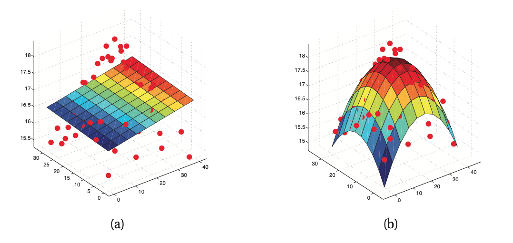

# Linear Regression

We can define a regression model as follows:

$$p(y|x, \theta) = \mathcal{N}(y| w^Tx, \sigma^2)$$

We can generalize this to model non-linear relationships, by introducing a **basis function** $\phi(x)$.

$$p(y|x, \theta) = \mathcal{N}(y| w^T\phi(x), \sigma^2)$$

This model is still linear in parameters. An example of a polynomial basis functions is:

$$\phi(x) = [1, x, x^2, \cdots, x^d]$$

a) $\hat{f}(x) = w_0 + w_1 x_1 + w_2x_2$

b) $\hat{f}(x) = w_0 + w_1 x_1 + w_2 x_2 + w_3x_1^2 + w_4 x_2^2$

The later is a quadratic .

# Fiting linear regression

The most common way is to perform [ordinary least squares](ordinary_least_squares_linear_regression.md)