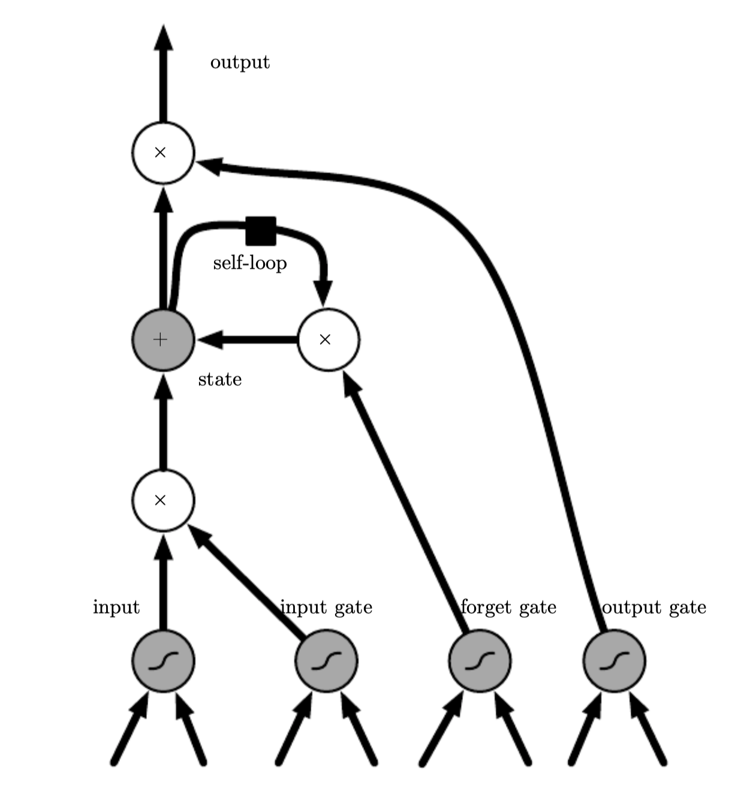

# LSTM

A [gated recurrent neural network](recurrent_neural_networks.md) where the gradient can flow for a long duration. The weights in the self loop depend on the context, and is gated (controlled by a different hidden unit). The same time scale of integration can change dynamically even if the parameters are fixed.

LSTM cells have internal recurrence (self loops) in adition to the outer recurrence of the RNN. Each cell has the same input and output as a RNN, but in addition it has more parameters and a system of gating units that control the flow of information. The most important component is state unit $s^{(t)}$, which has a linear self-loop weight, similar to [leaky units](leaky_units.md) This self loop is controlled by a forget gate unit $f^{t}_i$ (t - timestep, i - cell) which sets this weight to value between (0,1) with a sigmoid unit:

$$
f_i^{(t)} = \sigma(b_i^f + \sum_j U_{ij}^fx_j^{(t)} + \sum W_{i,j}^fh_h^{(t-1)})
$$

* $x^{(t)}$ is the current input vector
* $h^{(t)}$ the current hidden layer containing the output of all the LSTM cells
* b^f, U^f, W^f are the bias, input weights and recurrent weights for the forget gate

The internal state is updated similarly:

$$
s_i^{(t)} = f_i^{(t)}s_i^{(t-1)} + g^{(t)}_i \sigma(b_i + \sum_j U_{ij}x_j^{(t)} + \sum W_{i,j}h_h^{(t-1)}
$$

* b, U, W are the bias, input weights and recurrent weights into the LSTM cell
* $g_i^{(t)}$ is the external input gate

$$
g_i^{(t)} = \sigma(b_i^g + \sum_j U_{ij}^gx_j^{(t)} + \sum W_{i,j}^gh_h^{(t-1)})
$$

The output $h^{(t)}$ can be shut down trough the output gate $g^{(t)}_i$

$$
h_i^{(t)} = \tanh(s_i^{(t)})q_i^{(t)} \\
q_i^{(t)} = \sigma (b_i^o + \sum_j U_{ij}^ox_j^{(t)} + \sum W_{i,j}^oh_h^{(t-1)})
$$