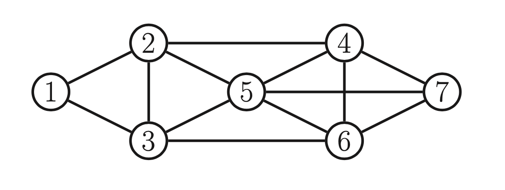
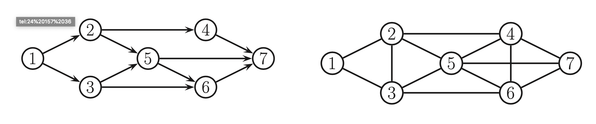

# Conditional independence in [Markov Random Fields](markov_random_fields.md)

Two nodes A and B are graph separated if there is no path form A to B. Or we can say that A and B are dependent if they are connected by a path of unobserved variables.

## Global Markov property

In [MRF](markov_random_fields.md) we define conditional independence relationship via simple graph separation. 

For a set of nodes A,B and C we can say that $x_A \perp_G x_B | x_c​$ iff C separates A from B in graph G.  This means when we remove all the nodes in C, if there are no paths connecting any node in A to any node in B, then the Ci property holds. This is called the **Global Markov property** for UGMs.

We have:

$$\{  1,2 \} \perp \{ 6,7 \} | \{3, 4, 5 \}$$ 

## Markov blanket

Is the smallest number of nodes that renders a node $t​$ conditionally independent lf all the other nodes in the graph is called $t​$'s **Markov Blanket**, and it is denoted $mb(t)​$. Formally this is:

$$ t \perp V /\ cl(t)| mb(t) $$

* $cl(t) \triangleq mb(t) \cup \{t \}$ is the closure of node t

In an UGM a node's Markov Blanket is its set of immediate neighbors. And it is called **undirected local Markov property**. 

$mb(5) = \{2,3,4,6,7 \}​$

## Pairwise Markov Property

From this property we can see that two nodes are conditionally independed given the rest if there is no direct edge between them.  More formally:

$$ s \perp t | V /\ \{ s,t \} \iff G_{st} = 0 $$

## CI properties in UGM

We can summarize different CI properties for:

1. **Pairwise** $1 \perp 7 | rest$
2. **Local** $1 \perp rest | 2, 3$
3. **Global** $1,2 \perp 6,7 | 3,4,5$

**There Global Markov implies Local Markov which implies pairwise Markov**

$$
G \Rightarrow L \Rightarrow P \Rightarrow G
$$

Empirically it is easier to asses pairwise conditional independence. Hence we use pairwise CI to construct a graph from which global CI statements can be extracted. 

### Undirected alternative to d-separation

We cannot convert DGM to an UGM just by dropping the orientation of the edges. (To give an example we cannot convert a v-structure $A \rightarrow B \leftarrow C$ into $A-B-C$ which states that $A \perp C | B$ but it muss not hold for the first). To avoid inccorect CI statements, we have to add edges between the "unmarried" parents A and C, and then drop the arrows from the edges, forming a fully connected undirected graph. This process is called **normalization**:

Example of normalization:

We need to interconnect 2,3 since they have an common child 5, and we interconnect 4,5,6 since they have a common child 7. 

**Downside of normalization** is that we loose some CI information, and therefore we cannot use the normalized UGM to determine the Ci properties of DGM. 

