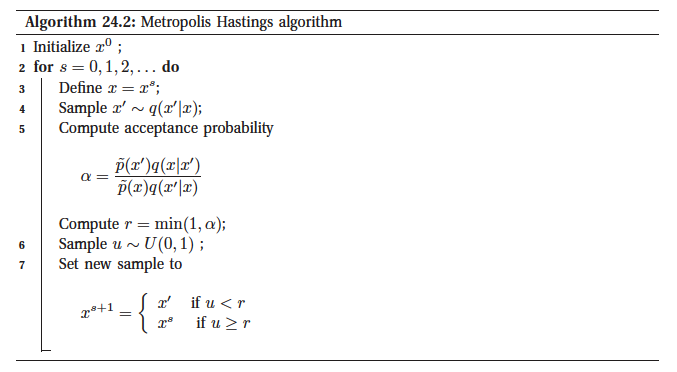

# Metropolis Hastings

Gibbs sampling is simple, but it is somewhat restricted in the set of models to which it can be applied. For example we cannot compute $p(w|D) $ for a logistic regression model, since the corresponding graphical model has no useful Markov strucutre. 

Fortunately there is a more general algorithm that can be used called **Metropolis Hastings (HM)**. 

## Basic idea

The basic idea is that at each step, we propose to move from the current state $x$ to a new state $x'$ with probability $q(x'|x)$ where $q$ is called the **proposal distribution** (also called **kernel**). Where we can use any proposal distribution we want, subject to some conditions. A common choise is to use a symmetric Gaussian distribution centered at the current state, $q(x'|x) = N(x'|x, \Sigma)$ this is also called **random walk Metropolis algorithm**. If we use $q(x'|x).= q(x')$ where thenew state indpenedent of the old state,  we get a method known as the **independence sampler**, which is simmilar to importance sampling.

Having propsed a move to $x'$, we decide to whether to **accept** this proposal, or not to according to some formula, which ensures that the fraction of time spent in each state is proportional to $p^*(x)$. If the proposal is accepted, the new state is $x'$, otherwise the new state is the same as the current state x. 

If the proposal is symmetric $q(x'|x) = q(x|x')$ , the acceptance probability is given by:

$$ r = min(1, \frac{p^*(x')}{ p^*(x)}) $$

This means that if $x'$ is more probable than $x$, we definitely move, but if $x'$ is less we may still move, but it depends on the relative probabilities. 

Hence instead of greedily moving to only more probable states, we occasionally allow downhill moves to less probable states. 

If the proposal is not symmetric, $q(x'|x) \ne q(x|x')$ we need the **Hastings correction** given:

$$
r = \min(a, \alpha) \\
\alpha = \frac{p^*(x')q(x|x')}{p^*(x)q(x',x)} = \frac{p^*(x')/q(x'|x)}{p^*(x)/q(x|x')}
$$

This correction is needed to compensate for the fact that the proposal distribution itself than just the target distribution may favour certain states. 

**Algorithm**:

### Importance of MH

To evaluate $\alpha$ we only need to known the target density up to a normalization constant. Suppose $p^*(x) = \frac{1}{Z} \tilde{p}(x)$ then:

$$
\alpha = \frac{\tilde{p}(x')/Z}{\tilde{p}(x)/Z} \frac{q(x|x')}{q(x',x)}
$$

so the Z's cancel. Hence we can sample $p^*$ even if Z is unknown. Hence all we need is to evaluate $\tilde{p}(x) = p^*(x)Z$ pointwise. 

## Compared to Gibbs sampling
Gibbs sampling is essentially MH where we allways accept the move to a new state.

## [Proposal distributions](metropolis_hastings_proposal_distribution.md)
In general we use a Gaussian but we can use other as well.

## [Why HM works](why_metropolis_hastings_works.md)
It satisfies the [detailed balance equation](stationary_distrion.md)

## Reversible jump (trans-dimensional) MCMC
Here we sample from space which has different dimensionality for different components. This is difficult sicne computing the HM acceptance ratio is not straight forward (it is like comparing circles to spheres). A solution to this is to augument the low dimensional space with extra random variables so that the two spaces have a common measure. 

Unfortunately in practice this is tricky. However if we have continuous parameters, we can analyticaly integrate them out, so we are left with discrete space, where we do not need to worry about change of measure. 

## High Dimensions

In general we generate proposals that are close to our current point, since in high dimenssions it is likely that a large step would be rejected. The disadvatage of small steps that this method will explore the probability space using a **random walk** and those take a long time to get anywere especially if the walk is made of small steps. This makes this inefficient.