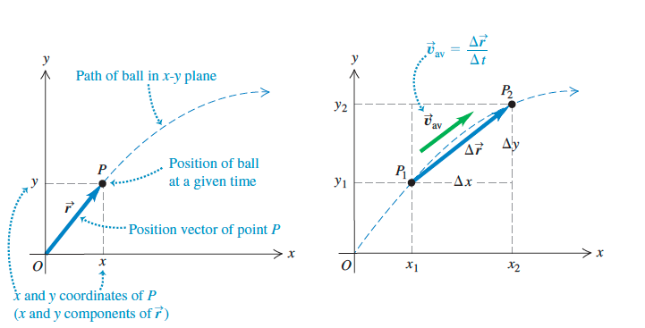

# Motion in plane
We extend the [one dimensional motion](one_dimensional_motion.md) into two dimensions. This generalizes than into tree dimensions.

The vector $\vec{r}$ is the **position vector** (x,v coordinates). If we want to measure the distance a particle has traveled whe take its magnitude:

$$
r = ||r||_2
$$

This can be viewed as displacement. We can now calculate the average velocity by:

$$
v_{av} = \frac{\Delta r}
{\Delta t} \\
v_{av} = \begin{bmatrix}
    v_{av,x} \\ v_{av,y}
\end{bmatrix}\\
v_{av,x} = \frac{\Delta x}{\Delta t} \\
v_{av,y} = \frac{\Delta y}{\Delta t} 
$$

This is a vector, and it has the same direction as $\Delta \vec{r}$ and the magnitude equal to the magnitude of $\Delta \vec{r}$ divided by $\Delta r$. And its components are the average velocity along each axes.

The magnitude $\Delta \vec{r}$ is always a straight line distance between two points, regardless of the actual path.

## Instantaneous velocity
Here ve just take the limit:

$$
\vec{v} = \lim_{\Delta t \rightarrow 0} \frac{\Delta \vec{r}}{\Delta t} \\
t_x = \lim_{\Delta t \rightarrow 0} \frac{\Delta x}{\Delta t} \\
v_y =\lim_{\Delta t \rightarrow 0} \frac{\Delta y}{\Delta t} 
$$

Here $\Delta \vec{r}$ becomes tangent to the curve of the trajectory. 

### Instantaneous speed 
Is just the magnitude of the instantaneous velocity.

$$
|\vec{v}| = \sqrt{v_x^2 + v_y^2}
$$

We can express the angle in which an object is traveling as:

$$
\theta = \tan^{-1} \frac{u_y}{u_x}
$$

## Acceleration in a Plane
Object is moving on a curved path in a plane

>The final velocity $v_2 = v_1 + \Delta v$ thus it is the sum of original velocity and the change in velocity.

### Average acceleration
During a time interval the velocity of a particle changes by $\Delta \vec{v}$

$$
\vec{a}_{av} = \frac{\Delta \vec{v}}{\Delta t}\\
a_{av,x} = \frac{\Delta v_x}{\Delta t} \\
a_{av,y} = \frac{\Delta v_y}{\Delta t} \\
$$

### Instantaneous acceleration

$$
\vec{a} = \lim_{\Delta t \rightarrow 0} \frac{\Delta \vec{v}}{\Delta t} \\
a_x = \lim_{\Delta t \rightarrow 0} \frac{\Delta v_x}{\Delta t} \\
a_y = \lim_{\Delta t \rightarrow 0} \frac{\Delta v_y}{\Delta t}
$$

Acceleration always points to the concave side of the curved path.

When a particle moves in a curved path, it always has nonzero acceleration, even when it moves with constant speed. Acceleration is associated with change of speed, change of direction of velocity, or both.

If we know the components $a_x, a_y$ we can find its magnitude and direction:

$$
|\vec{a}| = a = \sqrt{a_x^2 + a_y^2} \\
\theta = \tan^{-1} \frac{a_y}{a_x}
$$

The angle is counter clockwise.

If acceleration is parallel to the velocity of an object then there is no change in direction, otherwise we always change direction.