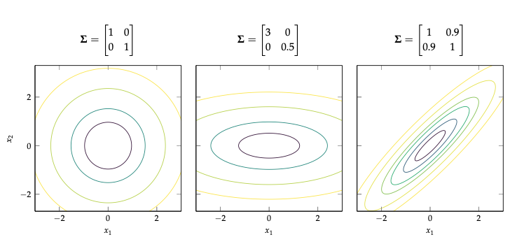
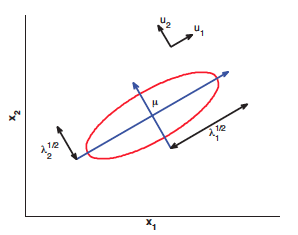
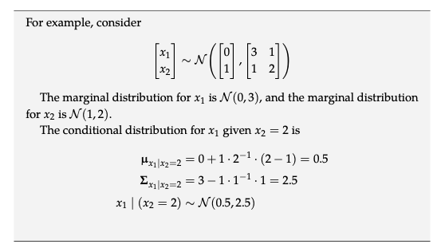

# Multivariate Gaussian

Extends the [gaussian distribution](gaussian_distribution.md) into higher dimensions.

$$N(x| \mu, \Sigma) \triangleq \frac{1}{(2\pi)^{D/2} |\Sigma|^{1/2}} \exp {[- \frac{1}{2}(x - \mu)^T \Sigma^{-1} (x - \mu)]}$$

Now we focus on the term in the exponent:

We can view $(x - \mu)^T \Sigma^{-1} (x - \mu)$ as the Mahalanobis distance of $x$.

If we perform *eigen value decomposition* on $\Sigma$ we get:

$$\Sigma = U \Lambda U^T \\ \Sigma^{-1} = U^{-T}\Lambda^{-1}U^{-1} = U\Lambda^{-1}U^T = \sum_{i=1}^D \frac{1}{\lambda_i} u_i u_i^T$$

Hence we can see that:

$$(x - \mu)^T \Sigma^{-1} (x - \mu) = (x - \mu)^T (\sum_{i=1}^D \frac{1}{\lambda_i} u_i u_i^T) (x - \mu) = \\ \sum_{i=1}^D \frac{1}{\lambda_i} (x - \mu)^T u_i u_i^T (x - \mu) = \sum_{i=1}^D \frac{y^2_i}{\lambda_i}$$

where:
* $y_i \triangleq u_i^T(x - \mu)$

Hence we can see the connection between an elipse in 2d:

$$\frac{y_1^2}{\lambda_1} + \frac{y_2^2}{\lambda_2} = 1$$

Here the eigen vectors determine the orintation of the ellipse, and the eigen values determine how elogonated it is.

In general, we see that the Mahalanobis distance corresponds to Euclidean distance in a
transformed coordinate system, where we shift by $\mu$ and rotate by U.

# MLE

Given we have N i.i.d samples $x_i \sim \mathcal{N}(\mu,\sigma)$ then the MLE for parameters is:

$$ \bar{\mu}_{MLE} = \frac{1}{N}\sum_{i=1}^N x_i \triangleq \bar{x}$$

$$ \bar{\Sigma}_{MLE} = \frac{1}{N} \sum_{i=1}^N (x_i - \bar{x})$$

Which are only empirical means.

# Join Gaussian:

$$
\begin{bmatrix}
    a \\ b
\end{bmatrix} \sim N(\begin{bmatrix}
    \mu_a \\ \mu_b
\end{bmatrix}, \begin{bmatrix}
    A & C \\ C^T & B
\end{bmatrix})
$$

We can express $a,b$ marginaly as:
$$
a \sim N(\mu_a, A) \\
b \sim N(\mu_b, B)
$$

The conditional distribution $a|b$ has the form:

$$
a|b \sim N(\mu_{a|b}, \Sigma_{a|b}) \\
\mu_{a|b} = \mu_a + CB^{-1}(b - \mu_b) \\
\Sigma_{a|b} = A - CB^{-1} C^T 
$$

Example:

# Maximum entropy distribution
Gaussian distribution is the maximum entropy distribution for any distribution if we are willing to assume that a distriibution has a mean and covariance.