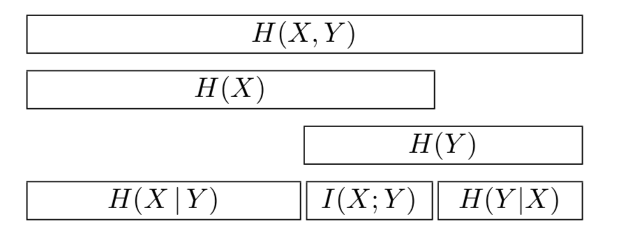

# Mutual information
Given 2 random variables $X$ and $Y$ we may ask, if we know X how much knowledge we gain about Y. We can achieve this by comparing the [KL Divergence](./kl_divergence.md) the joint distribution $p(X,Y)$ with the factored distribution $p(X)p(Y)$. 

$$
I(X;Y) \triangleq KL(p(X,Y)||p(X)p(Y)) = \sum_x \sum_y p(x,y) \log \frac{p(x,y)}{p(x)p(y)}
$$

* This is always positive 
* $I(X;Y) = 0$ only if $p(X,Y) = p(X)p(Y)$

**ONLY defined for discrete random variables**

## Entropy 

Mutual information can be expressed using entropy:

$$
I(X;Y) = H(X) - H(X|Y) = H(Y) - H(Y|X)
$$

* $H$ is the [entropy](./entropy.md)
* $H(Y|X) = \sum_x p(x)H(Y|X=x)$ is the conditional entropy

This can be interpreted as the reduction in uncertainity about X after observing Y (And vice versa) 

# Point wise mutual information
This defines MI between two events (not random variables).

$$PMI(x,y) \triangleq \log \frac{p(x,y)}{p(x) p(y)} = \log \frac{p(x|y)}{p(x)} = \log \frac{p(y|x)}{p(y)}$$

Measures the discrepancy between these events occuring together $(p(x,y))$ compared to what would be expected by chance $(p(x)p(y))$ (they are independent). 

Alternatively we can view it as the amount we learn from updating the prior $p(x)$ into the posterior $p(x|y)$. ($\frac{p(x|y)}{p(x)}$)

# Continuous random variables
We have to discretize them first. Unfortunately this involves choosing the number of bins, and finding their boundaries. 

There is an approach, **maximal information coefficient (MIC)**, which tries many different bin sizes and lcoations to compute the maximum MI achieved.