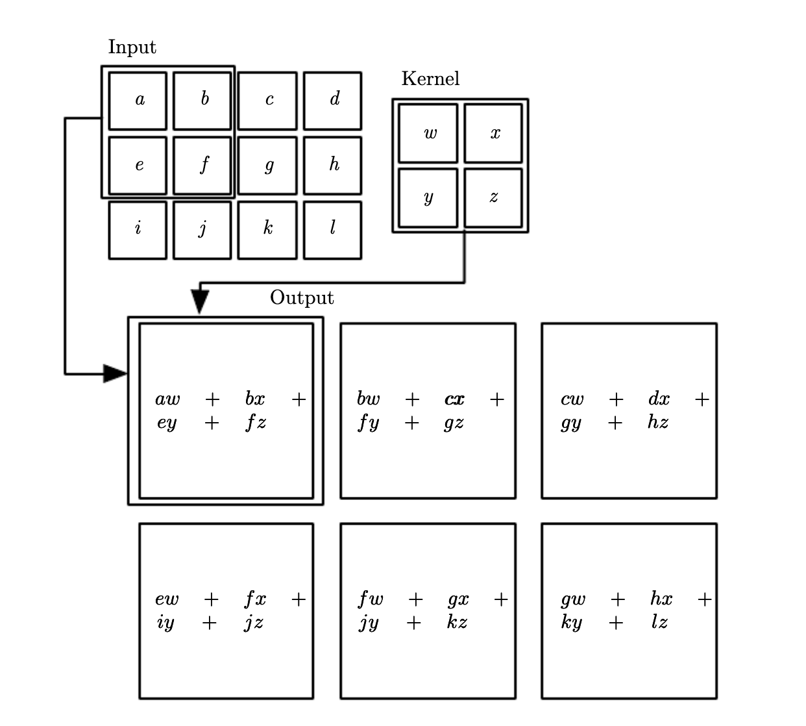
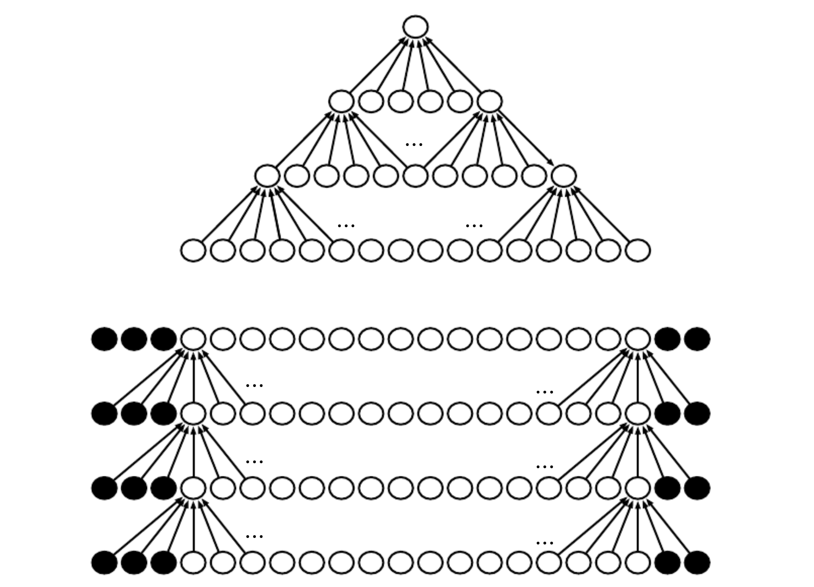

# Computer Vision neural networks

## Convolutional neural networks
Specialized neural networks to process grid-like data:

* 1D time-series
* 2D image

Most Convolutional networks run in 3 phases

1. Convolution phase, we apply filters in parallel and produce a set of linear activations
2. Detector phase, we pass linear activations trough a nonlinear activation function.
3. Pooling stage

### Convolution
They perform an specific [convolutin operation](convolution_operation.md) which is used instead of general matrix multiplication.

> Convolution operation
> $$
s(t) = \sum_{a=-\infty}^ tx(a) w(t-a) 
$$

In CNN $x(a)$ is referred as input, $w$ is the kernel and the output $s$ is the feature map. In CV we have multi dimensional convolution. Tthe definition for two dimensions is:

$$
S(i,j) = (I * K)(i,j) = \sum_{m}\sum_{n} I(m,n) K(i-m, j-n) \\
= \sum_{m}\sum_{n} I(i-m, j-n)K(m,n)
$$

In the later we flipped the kernel. Most NN libraries implement convolution as cross correlation.

$$
S(i,j) = (I * K)(i,j) = \sum_m \sum_n I(i+m, j+n)K(m,n)
$$

#### Motivation
**Sparse interactions**
In a fully connected NN there is a separate parameter (interaction) between each input and output unit. In CNN kernels are smaller than inputs, and they are forced to detect useful featrues (edges). They reduce memory requirements and improve efficiency.

**Parameter sharing**
Each Filter is reused at every position in the input. This parameter sharing causes layers to be [equivariante](equivariante_function.md) to translation. Equivariance in images cases that if we move an input than its representation will be moved by the same amount in the output.

### Pooling
Pooling function replaces the output at certain locations with a summary statistics of the nearby outputs. Max pooling reports the maximum output within a rectangular neighborhood. Other pooling methods involve average pooling or L2 norm.

Pooling helps the representations to be approximately invariant to small translations of the input. Invariant to translations means that if we translate the input by a small amount, the most pooled output do not change. This is important when we do not care where a feature is exactly present.

Pooling summarizes the response over a whole neighborhood, it is possible to have fever pooling units than detector units, if we report summary stats for pooling regions spaced k pixels apart. This reduces the number of parameters for the next layer.

Convolution and pooling can be viewed as an infinitely strong prior (some parameters are forbidden) that the weights of one hidden unit must be identical to the weights its neighborhood only shifted in space. And the weight is zero except to a small spatially continuous receptive field assigned to a hidden units. This forces a layer to identify local interactions that are invariant to local translation.

### Padding
In general we zero pad the input V to make it wider. Without padding the width of the representations would shrink by one pixel less than the kernel width at each layer.

There are couple of variants of padding.
* same padding, thus we add so many zeroes that the output is the same shape as the input
* full zero padding, we ad enough zeroes that every pixel is visited in k times in each directions, the output has width $m+k-1$. In this case the output pixels at the border are functions of fewer pixels than output pixel at the center. This will cause that we learn kernels that do not perform well at any location.

