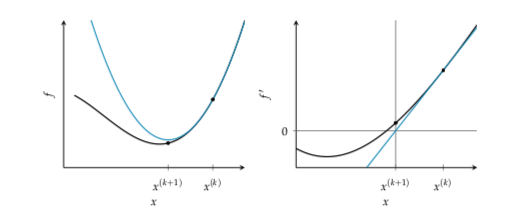

# Newtons Method
The gradient gives us the direction of [steepest descent](gradient_descent.md), but it does not tells us how far we should step. Adding second order information allows us to perform an quadratic approximation of the objective function and approximate the right step size to reach a local minimum. Thus we can analytically obtain the location where the quadratic approximation has zero gradient. We use that location as the starting point for the next iteration.


First vs second order approximation. The bell shaped quadratic approximation has a unique location where the derivative is zero.

The basis of this method is to perform a Second Order Taylor Approximation:

$$q(x) = f(x^{(k)}) + (x - x^{(k)})f'(x^{(k)}) + \frac{(x - x^{(k)})^2}{2} f''(x^{(k)})$$

At finding it where the derivative is zero:

$$ \frac{\partial q}{\partial x} = f'(x^{(k)}) + (x-x^{(k)})f''(x^{(k)}) $$

From this we can derive the update rule:
$$ x^{(k+1)} = x^{(k)} - \frac{f'(x^{(k)})}{f''(x^{(k)})}$$



Newtons method can be explained as a root finding method applied to f' that iteratively improves a design point by taking the tangent live at $(x, f'(x))$ finding the intersection with the $x$ axis and use that intersection as a new starting point. 

Newtons method is not applicable when the second derivative is zero. This happens when the quadratic approximation is a horizontal line. Instability also occurs when the second derivative is close to zero, in this case the next iterate will be far from the current design point, far from where the current quadratic approximation is valid.

Some examples when Newtons method fails:


Newtons method tend to converge quickly in a bowl like region that is sufficiently close to a local minima. It has quadratic convergence, that means that the difference between the minimum and the iterate is approximately squared with every iteration. 

Quadratic convergence $x^{(1)}$ within a distance $\delta$ of a root $x^*$ happens if:

* $f''(x) \ne 0$ for all point in $I$
* $f'''(x)$ is continuous on $I$
* $\frac{1}{2}|\frac{f'''(x^1)}{f''(x^1)}| \le c |\frac{f'''(x^*)}{f''(x^*)}|$ for some $c \le \infty$. This condition enforces sufficient closeness, ensuring that the function is sufficiently approximated by a Taylor expansion. And guards against overshooting. 
* $I = [x^* - \delta, x^* + \delta]$


## Multivariate case
$$f \approx f(x^{(k)}) + (g(x^{(k)}))^T (x - x^{(k)}) + \frac{1}{2} (x - x^{(k)})^T H^{-1} (x - x^{(k)})$$

$$\nabla g(x) = g^{(k)} + H^{(k)} (x - x^{(k)}) = 0$$
$$x^{(k+1)} = x^{(k)} - \frac{g^{(k)}}{H^{(k)}}$$

In  case that $f$ is quadratic and the Hessian $H \succ 0$ than Newtons method converges in a single step. 

To increase the robustness of Newtons method we can add a step size and use line search or momentum.

## Algorithm

```
def newtons_method(gradient, hessian, x, epsilon, max_iter):
    k = 1
    delta = np.fill_diagonal(np.Inf, len(x))
    while np.sum(delta * 2) > epsilon and k <= max_iter:
        delta = hessian(x) / gradient(x)
        x -= delta
        k += 1
    return x
```

## As descent direction
Newtons method can be used to supply the descent direction.

$$ d^{(k)} = - (H^{(k)})^{-1} g^{(k)}$$
