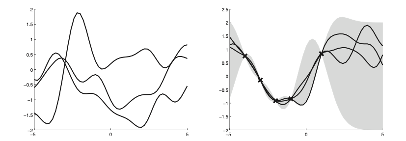

# Noise-free [Gaussian Process Regression](gaussian_process_regression.md)

Suppose we observe a traning set $D = \{(x_i, f_i), i = 1:N\}$ where $f(x_i)$ is the nosie-free observation of the function evaluated at $x_i$. Given a test set $X_*$ of size $N_{*}\times D$ we want to predict the function outputs $f_*$. 

If we ask the GP to predict $f(x)$ for a value of x that it has already seen , we want the GP to return an answer $f(x)$ with no uncertainity. In other words, it should act as an **interpolator** of the traning data.  This is only possible if we assume that the observations are noiseless. 

By definition of GP, the join distribution has the following form:

$$
\begin{pmatrix}
    f \\ f_*
\end{pmatrix} 
\sim 
\mathcal{N}(
    \begin{pmatrix} \mu \\ \mu_* \end{pmatrix}, 
    \begin{pmatrix} K & K_* \\ K_*^T & K_{**}\end{pmatrix})
$$
* $K_{N \times N} = k(X,X)$
* $K_{*_{N \times N_*}} = k(X,X_*)$
* $K_{**_{N_* \times N_*}} = k(X_*, X_*)$

By the rules for [conditioning Gaussians](joint_gaussian_inference.md) we get:

$$
p(f_*|X_*,X, f) = N(f_*| \mu_*, \Sigma_*) \\ 
\mu_* = \mu(X_*) + K_*^TK^{-1}(f - \mu(X)) \\ 
\Sigma_* = K_** - K^T_*K^{-1}K_*
$$

Example:

On the left we draw samples from the prior $p(f|X)$ and the right from the posterior $p(f_*| X_*, X, f)$

Using an Gaussian kernel:

$$
\mathcal{k}(x, x') = \sigma^2_f \exp(- \frac{1}{2l^2} (x - x')^2)
$$

- $l$ controls the horizontal length
- $\sigma^2_f$ controls the vertical variation

One application of noise-free GP regression is as a computationally cheap proxy for the behavior of a complex simulator, such as a weather forecasting program. One can then estimate the effect of changing simulator parameters by examining their effect on the GP’s predictions, rather than having to run the simulator many times, which may be prohibitively slow. 
