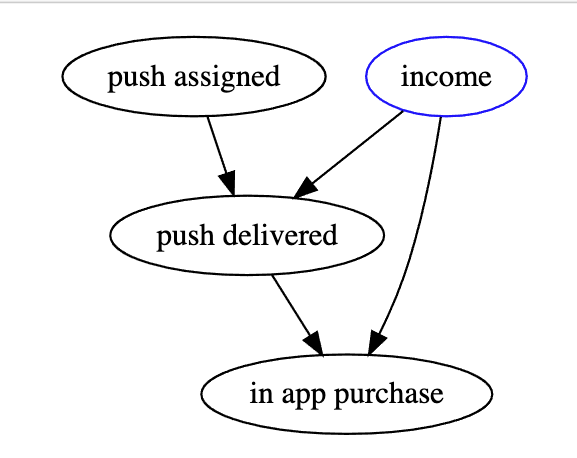
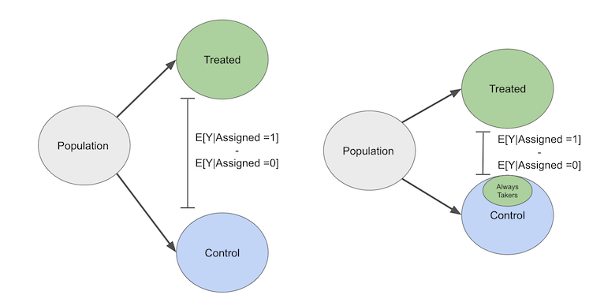
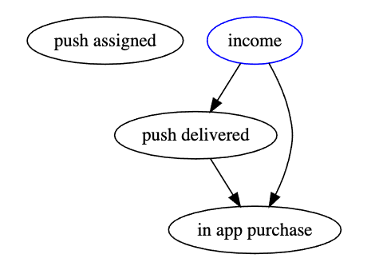

# Non Compliance LATE

* in real world we encounter the following groups
  
1. Compliers
   * they stick to what they get, if they are assigned to treatment they get treatment, if placebo they take placebo
2. Never Takers
   * they neither take treatment nor placebo
3. Allays Takers
   * they allways receive treatment even if they are asigned to placebo
4. Defiers
   * they always do the oposite, thus they take treatment if they are asigned to control or placebo if they are in treatment

* modern approach to IV is that we assume compliance is not perfect, thus we need to distinguish between:
  * internally valid causal effect, which is valid under particular settings and with particular data
  * externally valid causal effect, here we worry about the predictive prower on different samples

## Example:
* push notification to boost sales, where we take a random sample and perform an 50/50 split
* some assigned to receive, do not receive due to older phose, where we assume that those who have older phones have lower income
* the causal graph is:

  * push assigned is our treatment variables
  * income is an unobserved confounder
  * push delivered is an mediator
  * in app purchase is causal effect

* push assignemnt is random thus we assume:
   $$ATE = E[Y|pushAssigned=1] - E[Y|pushAssigned=0]$$
* this hold only when there is no bias:
   $$E[Y_0|pushAssigned=0] = E[Y_0| pushAssigned=1] = 0$$
* this is however not true since low income people have older phones that wont receive push notifications 
* instead of ATE we would find the causall effect of the treatment assignemnt
  
* non compliance grop push the outcome of the treatment groups towards the outcome of the control group. Non compliance flips the treatment, meaning the treatment and control are more similar.

* allways takers push the control group towards the treatment
* by analogy we can say never takers will pull the treatment group closer to the control
* **Causal effect of the treatment effect is biased twoards zero**, since non-compliaces shrinks it towards zero

* conditioning on push assignment is biased, thus we could condition on push delivery:

* this is a mediator, since we known that push delivery depends on phone age, and phone age depends on income because of that we have:
   $$
      E[Y_0|push=0] < E[Y_0|push=1] 
   $$

  * people  with older phones have lower income, this is a bias

## Local treatment Effect (LATE)
* we explicitly express the population that will receive treatment
* we view [instrumental variables](instrumental_variables.md) as a causal chain $Z \rightarrow T \rightarrow Y$ thus the instrumental variable only effect Y trough T
* we have new notation for potential outcomes

$$
Y_i(1,1) \text{ if } T_i=1, Z_i = 1 \\ 
Y_i(1,0) \text{ if } T_i=1, Z_i = 0 \\ 
Y_i(0,1) \text{ if } T_i=0, Z_i = 1 \\ 
Y_i(0,0) \text{ if } T_i=0, Z_i = 0
$$

* for the treatment now we get an potential coutome:

$$
T_0 \text{ if } Z_i = 0 \\
T_0 \text{ if } Z_i = 1
$$

* the IV assumptions are rexpressed as:

1. $T_{0i}, T_{1i} \perp Z_i$ and $Y_i(T_{1i}, 1), Y_i(T_{0i},0) \perp Z_i$, this is the **independence assumption**
   * insturment is good as randomly assigned. it is not correlated with potential treatments, thus people in different instruments are comparable

2. $Y_i(0,1) = Y_i(1,1) = Y_{i1}$ and $Y_i(1,0) = Y_i(1,1) = Y_{i0}$, **exclusion restriction** 
   * if i am looking at the potential outcome for the treated, it is the same for booth instrument groups (the instroment does not influence the potetnial outcome, of they influence it only trough treatment)
3. $E[T_{1i} - T_{0i}] \ne 0$ **existence of the first stage**
   * the instrument does not affect the treatment (potential treatments are different)

4. $T_{i1} > T_{i0}$ **monotonicity assumption**
   * if everyone has the instrument turned on, the treatment level would be higher than if every one had the treatment turned off

### Wald estimator
* to gain more insight we review the Wald Estimator 

$$
ATE = \frac{E[Y|Z =1] - E[Y|Z=0]}{E[Y|Z=1] - E[T|Z=0]}
$$

* first we break down $E[Y|Z=1]$

$$
E[Y_i|Z_i =1] = E[Y_{i0} + T_{i0}(Y_{i1} - Y_{i0})|Z=1] \text{ by exclusion restriction} \\
= E[Y_{i0} + T_{i0}(Y_{i1} - Y_{i0})] \text{ independence we can drop conditioning} \\
$$

* the same applies to $E[Y|Z=0]$

$$
E[Y_i|Z_i =1]  = E[Y_{i0} + T_{i0}(Y_{i1} - Y_{i0})]
$$

* the Wald rule numerator becomes:

   $$
   E[Y|Z =1] - E[Y|Z=0] = E[(Y_{i1} - Y_{i0})(T_{i1} - T_{i0}))] \\
   E[(Y_{i1} - Y_{i0})| T_{i1} > T_{i0} ]P(T_{i1} > T_{i0})
   $$
  * $(T_{i1} - T_{i0})$ is either 0 or 1 by monotomicity

* the Walds rule denominator:
   $$
   E[T|Z = 1] - E[T|Z=0] = E[T_{i1} - T_{i0}] = P(T_{i1} > T_{i0})
   $$

* if we put them together the Wald Estimator becomes

$$
ATE = E[(Y_{i1} - Y_{i0})| T_{i1} > T_{i0}]
$$

* ATE estimated by IV is the ATE on the subpopulation $T_{i1} > T_{i0}$, that is the group of compliers!!!

  * $T_{i1} > T_{i0}$ is the group of compliers
  * $T_{i1} = T_{i0} = 0$ are newertakers
  * $T_{i1} = T_{i0} = 1$ are allways takers 