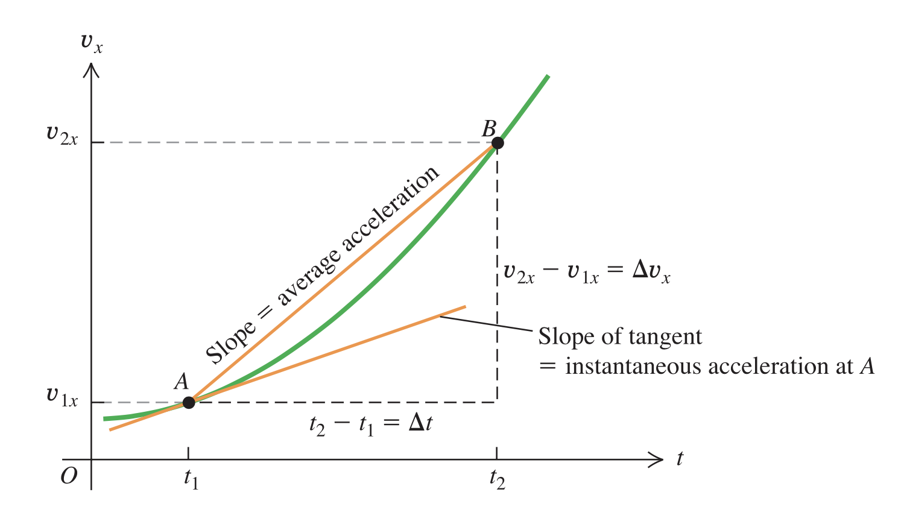
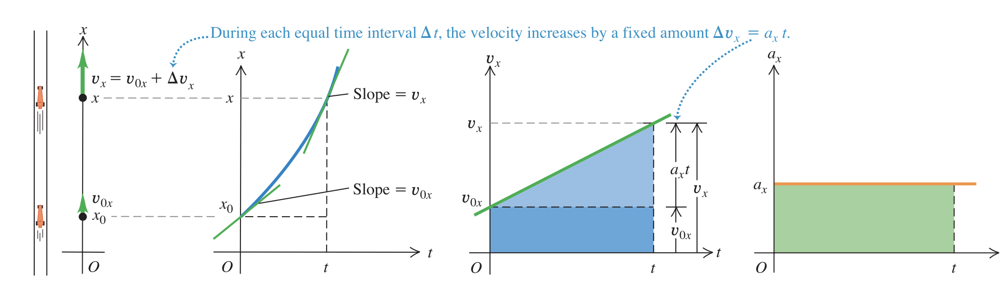

# Acceleration
If the velocity of a moving object changes with time, we say that the object has acceleration.Acceleration is a quantitative description of the rate of change of velocity with time. In general we divide an change in velocity by time. Thus this is again an vector quantity.

## Units
$$
\frac{(m/s)}{s} = m/s^2
$$
They are in meters per second sequared.

## Average acceleration
$$
a_{av,x} = \frac{\Delta v_x}{\Delta t}
$$

It is the difference between velocity divided by time. This difference can be negative if we are deaccelerating. Thus the velocity decreases.

## Instantaneous acceleration

$$
a_{x} =\lim_{\Delta t \rightarrow 0} \frac{\Delta v_x}{\Delta t}
$$

It is the acceleration at any given time or point along the path. In general if we talk about acceleration we think about instantaneous acceleration.

We can express acceleration as a function of t. 

The average acceleration between any two points on a graph of velocity versus time equals the slope of a line connecting those points.
The instantaneous acceleration at any point on the graph equals the slope of the line tangent to the curve at that point.

## Motion with contant accelration
The instantaneous acceleration does not change.

The change in velocity is a linear curve. The velocity after accelerating is:

$$
a_x = \frac{v_x - v_{0x}}{t-0} \\
v_x = v_{0x} + a_x t
$$

Thus it is the initial velocity plus, t times the acceleration.

If the acceleration is constant we can calculate the average velocity:

$$
v_{av,x} = \frac{v_{0x} + v_x}{2} \\
 = \frac{1}{2} (v_{0x} + v_{0x} + a_xt) \\ 
 = v_{0x} + \frac{1}{2}a_xt \\
 = \frac{\Delta x}{\Delta t}
$$

If $\Delta t = t - 0$ (we start at t = 0) we can simplify to:

$$
v_{av,x} = \frac{x-x_0}{t}
$$

### Position afther constant acceleration
We can put the equations together do derive:

$$
v_{0x} + \frac{1}{2}a_xt = \frac{x - x_0}{t} \\
x = x_0 + v_{0x}t + \frac{1}{2} a_xt^2
$$

If we express $t = \frac{v_x - v_{0x}}{a_x}$ (the time we need reach the target velocity under acceleration $a_x$). Now we can express the distance traveled as:

$$
x = x_0 + v_{0x} (\frac{v_x - v_{0x}}{a_x}) + \frac{1}{2}a_x (\frac{v_x - v_{0x}}{a_x})^2 \\
2a_x(x - x_0) = 2v_{0x} v_x - 2v_{0x}^2 + v_x^2
 - 2v_{0x}v_x + v_{0x}^2
$$

This can be simplified into:

$$
v_x^2 = v_{0x}^2 + 2a_x(x - x_0) 
$$

## Free falling
It is the acceleration due gravity, on earth this is:

$$
a = -g = 9.8m/s^2
$$
