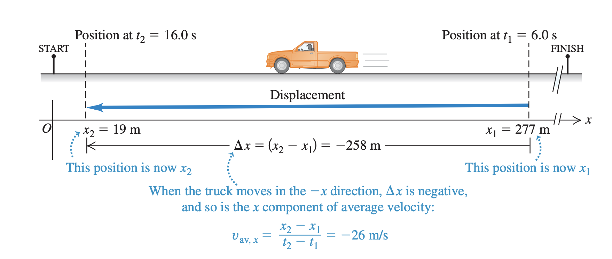
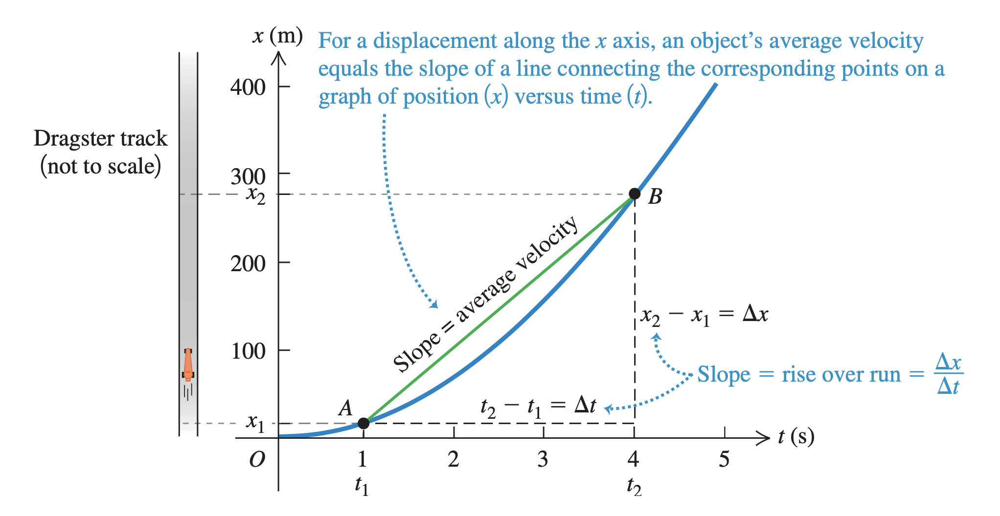
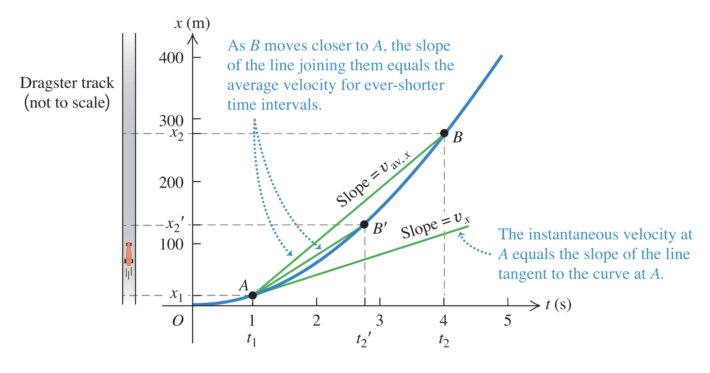

# One dimensional motion

We move along an single axis, from $x_1$ to $x_2$.

## Displacement
Is a vector valued quantity where we move from one point to the other. It is defined by a starting postion ending position and a direction in which an object moves.

 
The initial position $x_1 = 277m$ to the ending position $x_2=19m$ thus the displacement $\Delta x = -258m$

Since the value is negative, we know in which direction an particle is moving. (we have only one dimension)

## Velocity
Is a vector valued quanity, since we allways divide the displacement by time.

### Average velocity
$$
v_{av} = \frac{\Delta x}{\Delta t}
$$
* $\Delta x = x_2 - x_1$
* $\Delta t = t_2 - t_1$

It is the displacement divided by the time it took to displace.

>Example:
> An car is at $t_1 = 1s$ in position $x_1 = 19m$ and moves along the x axis. At $t_2=4s$ is at $277m$
> The average veloity is 
> $$v_{av} = \frac{277-19}{4-1} = 86 \text{m/s}$$

We can express the movement of a particle along a straight line as function:

$$
x = f(t)
$$

The average velocity between two positions is the slope of a line connecting the two corresponding points on a graph of position as a function of time.

### Instantaneous velocity
In general velocity is not constant, the **instantaneous velocity**  is the velocity of a particle at any one specific instant of time or point in path.

$$
v_x = \lim_{\Delta_t \rightarrow 0} \frac{\Delta x}{\Delta t}
$$

The instantaneous velocity at any point is equal to the slope of the tangent line to the curve at that point.

## [Acceleration](one_dimensional_acceleration.md)
Here we accelerate in one dimension, mostly focusin on constant acceleration.