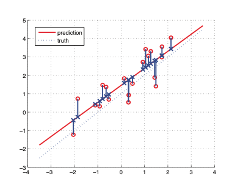
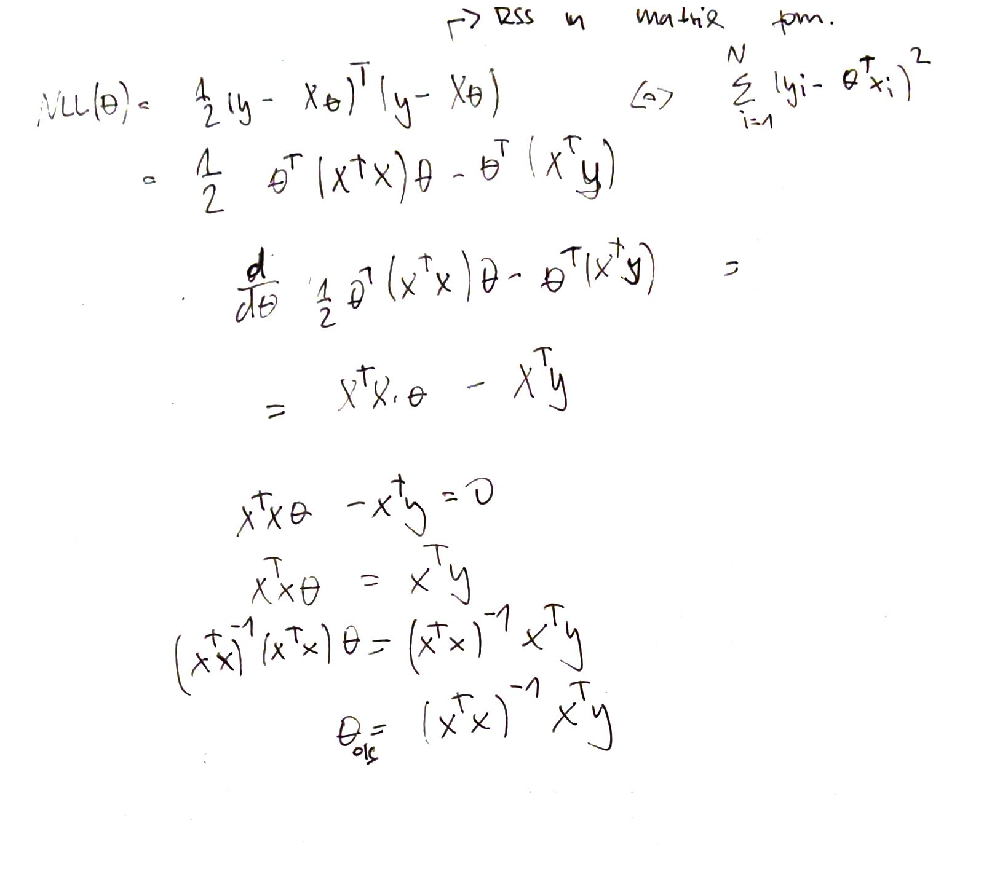
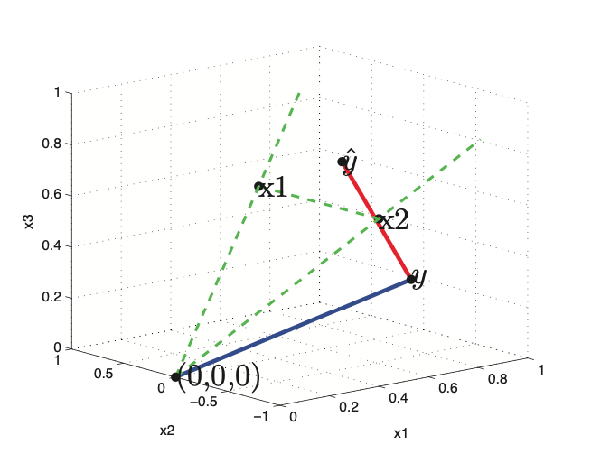

# Ordinary Least Squares (MLE) 

This is the maximum likelihood estimation for an [linear regression model](linear_regression.md) where we maximize the log likelihood:

$$\hat{\theta} \triangleq \arg \max_{\theta} \log p (D|\theta) $$

We assume that the observations are I.I.D, and we prefer minimizing to maximing so we define the **negative log likelihood (NNL)** which is a [convex function](convex_function.md):

$$ NLL(\theta) \triangleq - \log p(D|\theta) =  - \sum_{i=1}^N \log p(y_i| x_i, \theta)$$

Now if we assume that the likelihood is Gaussian we get:

$$NLL(\theta) = \sum_{i =1}^N \log [(\frac{1}{2 \pi \sigma^2})^{\frac{1}{2}} \exp ( -\frac{1}{2\sigma^2} (y_i - w^Tx_i)^2 )] \\ = \frac{-1}{2\sigma^2} RSS(w) + \frac{N}{2} \log (2 \pi \sigma^2) $$

* $RSS(w)$ is the [sum of squares](sum_of_squares.md)

OLS tries to minimize the sum of squares:

## Derivation of MLE  (OLS)
Here we derive the ordinary least squares equation:

$$\hat{w}_{OLS} = (X^TX)^{-1}X^Ty $$

## Geometric interpretation of OLS (MLE)

Now if we assume $N > D$, that meas we have more observations that features. That means that the columns of X define a subspace of dimensionality D which is embeded in N dimensions. This meas that the vector of observed target values $y$, wil be outside the subspaces spaned by X. Hence our goal is to find a vector $\hat{y}$ such that is as close to $y$ than possible. 

This can be done, by projecting $y$ onto the subspace spanned by $X$. In other words we want to find a linear combination of column vectors of X. $\hat{y} = w_1 x_1 + \cdots + w_D x_D = Xw$. We define the error vector $\epsilon = y - \hat{y}$, if this vector will be orthogonal to every column vector of X, than we find the projection $\hat{y}$ that is closest to the true value $y$. 

$$X^T (\epsilon) \Rightarrow X^T( y - \hat{y}) \Rightarrow X^T(y - Xw) = 0$$

If we expand the equation we get:

$$w = (X^TX)^{-1}X^T y$$

Now our projected value of $\hat{y}$ is given as:

$$\hat{y} = Xw = X(X^TX)^{-1}X^T y$$

This corresponds to an **orthogonal projection** of y onto the column space of X. Where $P \triangleq X(X^TX)^{-1}X^T$ is the projection matrix. 

