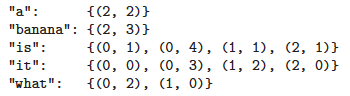

# Page Rank

We will treat the web as a giant directed graph, where nodes represent web pages (documents) and edges represent hyper-links.

All of the words in each web page are entered into a data structure called an inverted index. That is, for each word, we store a list of the documents where this word occurs. At test time, when a user enters a query, we can just look up all the documents containing each word, and intersect these lists We can get a refined search by storing the location of each word in each document. We can then test if the words in a document occur in the same order as in the query.

For the following 3 documents "it is what it is", "what is it", "it is a bannana" the inverted index is:

We can then return the matching documents in decreasing order of their score/ relevance. This is called document **ranking**.

So far, we have described the standard process of information retrieval. But the link structure of the web provides an additional source of information. The basic idea is that some web pages are more authoritative than others, so these should be ranked higher (assuming they match the query). A web page is an authority if it is linked to by many other pages. But to protect against the effect of so-called link farms, which are dummy pages which just link to a given site to boost its apparent relevance, we will weight each incoming link by the source’s authority. Thus we get the following recursive definition for the authoritativeness of page j, also called its **PageRank**:

$$
\pi_j = \sum_i A_{ij}\pi_i
$$

where $A_{ij}$ is the probability of following a lin from i to j. The stationary distribution represents the authority of a page.  Where the equation is just the stationary distribution of a Markov chain. Unfortunately this adjacency matrix is highly sprace, hence we need to augument the matrix a bit, we need to give a small probability of going from *any* state $i$ to any *state* $j$