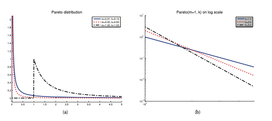

#  Pareto distribution
It is a distribution that is used to model the distribution of quantities that exhibit **long tails**, (heavy tails). An example is the english word frequency: the most frequent word occurs twice as ofthen as the second, the second occurs twice as ofthen as the fourth most frequent. If we would plot the frequencey of words vs their rank, we will get a power law (Zipf's law)

Here we can say that a random variable has Pareto distribution $X \sim Pareto(k,m)$ if it has the following pdf:

$$Pareto(x| k,m) = km^k x^{- (k + 1)} I(x \ge m)$$

This density asserts that x must be greater than some constant m, but not too much greater, where k controls what is too much, as $k \rightarrow \infty$ the distribution approaches $\delta(x - m)$.

# Moments
## Mean
$$E[X] = \frac{km}{k - 1} \text { if } k > 1$$ 

## Variance
$$var[X] = \frac{m^2 k}{(k -1 ) ^ 2 (k -2)}, \text{ if } k > 2$$

## Mode
$$mode(x) = m$$
