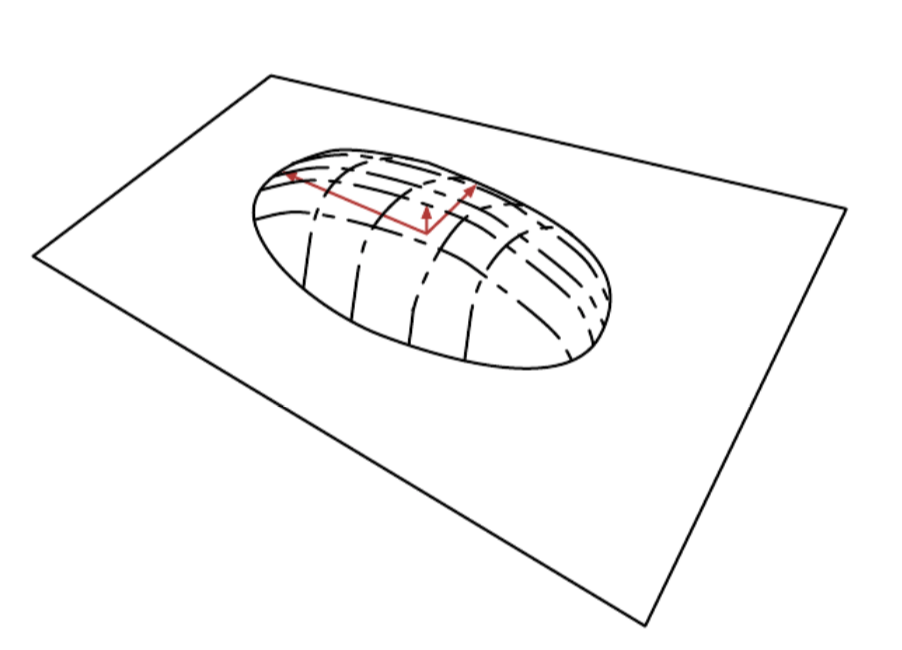

# Principal Component as a Manifold

We can view [probabilistic PCA](principal_component_analysis.md) as defining a thin pancake shaped region of high probability.

This is interpretation is valid for any linear [autoencoder](autoencoder.md) that learns matrices W and V with the goal of making the reconstruction of $x$ lie as close to $x$ as possible.

The encoder is:

$$
h=f(f) = W^T(x-\mu)
$$

It computes an lower dimensional representation of $h$. With the autoencoder we have also a decoder that reconstructs the input:

$$
\hat{x} = g(h) = b + Vh
$$

The choice of linear encoder and decoder is to minimize the reconstruction error:

$$
E[||x - \hat{x}||^2]
$$

With $W=V, u,b = E[x]$ and $W$ form an orthogonal basis, which spans the same subspace as the principal eigenvectors of the covariance matrix.

$$
C = E[(x-\mu)(x-\mu)^2]
$$

For PCA the columns W are the eigenvectors ordered by the magnitude of the corresponding eigenvalues. We can show that the eigenvalue of $x_i$ of $C$ correspond to the variance of X in the direction of eigenvector $v^{(i)}$. If $x \in R^D$ and $h\in R$ with $d < D$ then the optimal reconstruction error:

$$
\min E[||x - \hat{x}||^2] = \sum_{i=d+1}^D \lambda_i
$$

If the covariance has rand d, the eigenvalues $\lambda_{d+1}$ to $\lambda_D$ are 0 and the reconstruction error is $0$.

The same solution can be obtained by maximizing the variance of the elements of $h$, under orthogonal $W$.