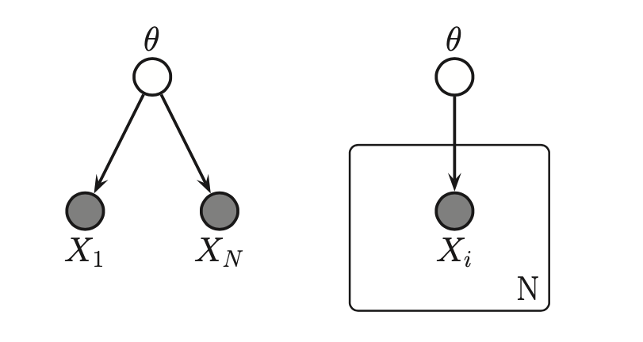
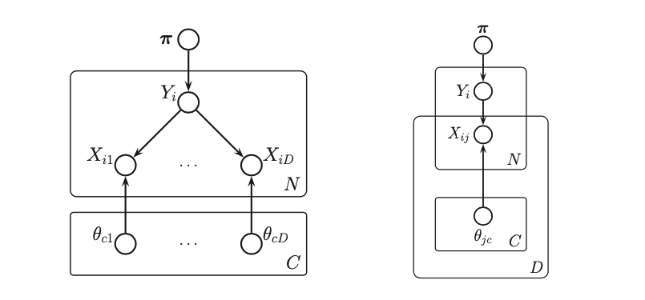

# Plate notation

If we assume that the data is iid. There is a more compact representation for data.

The equation:
$$p(\theta|D) = p(\theta) [\prod_{i=1}^N p(x_i|\theta)]$$

Can be expressed as:

The picture with a plate represents that the total number of $X_i$ is N. And it can be expanded as on the left. Here we assume that the data is conditionally independent only on the parameters $\theta$, and it does not matter in which the data arrives. We say the data is **exchangeable**.

A **plate** is a little box around the repeated variables, and the convention is that nodes within the box will get repeated when the model is **unrolled**. The number of copies or repetitions is written in the bottom right corner of the box.

An more complex example:

On the left we show a naive Bayes classifier that has been “unrolled” for $D$ features, but uses a plate to represent repetition over cases $i = 1 : N$. The version on the right shows the same model using nested plate notation. When a variable is inside two plates, it will have two sub-indices. For example, we write $\theta_{jc}$ to represent the parameter for feature $j$ in class-conditional density $c$. What is not clear is that $\theta_{jc}$ is used to generate $x_{ij}$ iff $y_i = c$ otherwise ignored. This is an example of **context specific independence** since the CI relationship $x_{ij} \perp \theta_{jc}$  hold if $y_i \ne c$
