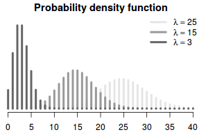

# Poisson distribution
Describes number (count) of independent discrete items or events recorder for a given effort. It is bounded $(0,\infty)$ 

$$f(x;\lambda) = \frac{e^{-\lambda}\lambda^x}{x!}$$
* $\lambda$ is the expected value

# Properties 
* mean and variance are equal to $\lambda$

## Connections between Poisson and Binomial

**Pois -> Bin**
If we have two random variables 
$$ X \sim Pois(\lambda_1) \\
Y \sim Pois(\lambda_2)
$$

Where X is independent of Y, than
$$X + Y \sim Pois(\lambda_1 + \lambda_2)$$

Now if we going to condition $X | X+Y$ then

$$X + Y = n \\
X|n \sim Bin(n, \frac{\lambda_1}{\lambda_1 + \lambda_2}) $$

**Bin -> Pois**
Now if we have a Binomial random variable 
$$Bin(n,p)$$
Where 
* $n \rightarrow \infty$
* $p \rightarrow 0$

Than we can approximate the binomial distribution with a poisson distribution $\lambda = np$
$$ Bin(n,p) \approx Pois(np)$$

## Relationship to Gamma distribution
There is a deep relationship between Gamma and Poisson distribution. The Poisson process explains the number of successes during time $t$, where the rate of successes is $\lambda$. Gamma distribution on other hand, tells us about the total waiting time till the ath arrival in a Poisson process with rate $\lambda$. 

### Conjugacy
The gamma distribution can be used as a prior distribution for the rate parameter $\lambda$ in a Poisson distribution. 

$$
\lambda \sim \text{Gamma}(r_0, b_0) \\
Y_1, \cdots, Y_n  \sim \text{Pois}(\lambda t) \\
\lambda | Y \sim Gamma(r_0  + n\bar{y}, b_0 + n) 
$$

* $\bar{y} = \frac{1}{n}\sum_{i=1}^n y_i$

## Sum of two Poisson distribution

Given we have random variables that follow poisson distribution:

$$
X \sim \text{Pois}(\lambda_1) \\
Y \sim \text{Pois}(\lambda_2) 
$$

If X and Y are independent than we have:

$$
X + Y \sim  \text{Pois}(\lambda_1 + \lambda_2)
$$