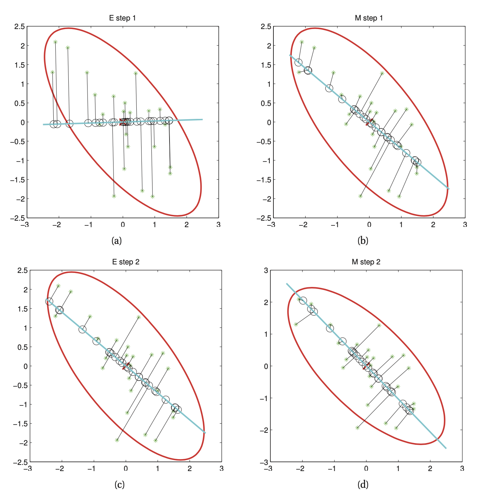

# EM For PPCA

This is an [expectation maximization algorithm](em_algorithm.md) for Probabilistic PCA but it works in the limit $\sigma^2 \rightarrow 0$

Let $\tilde{Z}_{L \times N}$ matrix storing the posterior means alog ints columns. And let $\tilde{X} = X^T$ store the original data along its columns. 

$$\text{ E step } \tilde{Z} = (W^TW)^{-1}W^T\tilde{X} \\ 
\text{M step } W = \tilde{X}\tilde{Z}^T (\tilde{Z} \tilde{Z}^T)^{-1} $$

The Physical analogy can be explained as:

Here we can view starts as points an the black line as a string connected to a rod. In the E step, we hold the rod fixed, and let the attachment points slide around so as to minimize the spring energy (which is proportional to the sum of squared residuals). In the M step, we hold the attachment points fixed and let the rod rotate so as to minimize the spring energy.

## Advantages of EM for PCA

* Can be faster 
* Can be implemented online fashion
* Can handle missing points
* We can modify it to perform variational EM or variational Bayes EM.