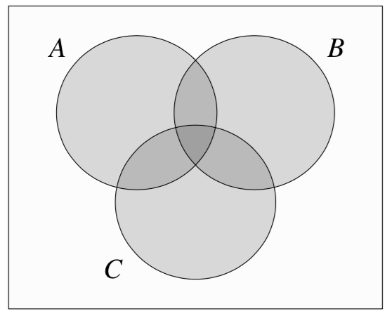

# Inclusion Exclusion Probability

In case that we observe 3 events A,B,C the probability that A or B or C has happend is as follows:

$$
P(A \cup B \cup C) = P(A) + P(B) + P(C) - P(A \cap B) - P(A \cap C) - P(B \cap C) + P(A \cap B \cap C)
$$

We can generalize this for multiple events:

$$
P(A_1 \cup A_2 \cup \cdots \cup A_n) = \sum_i P(A_i)  - \sum_{i < j}P(A_i \cup A_j)  + \sum_{i<j<k}P(A_i \cap A_j \cap A_k)  - \cdots (-1)^{n+1} P(A_1 \cap A_2 \cap \cdots \cap A_n)
$$