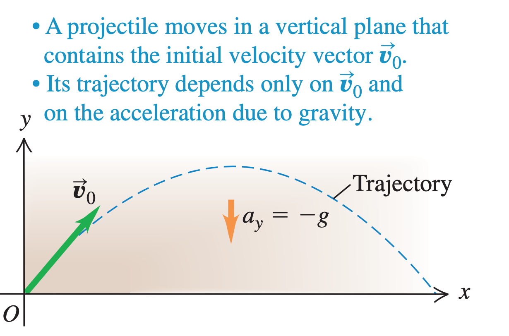
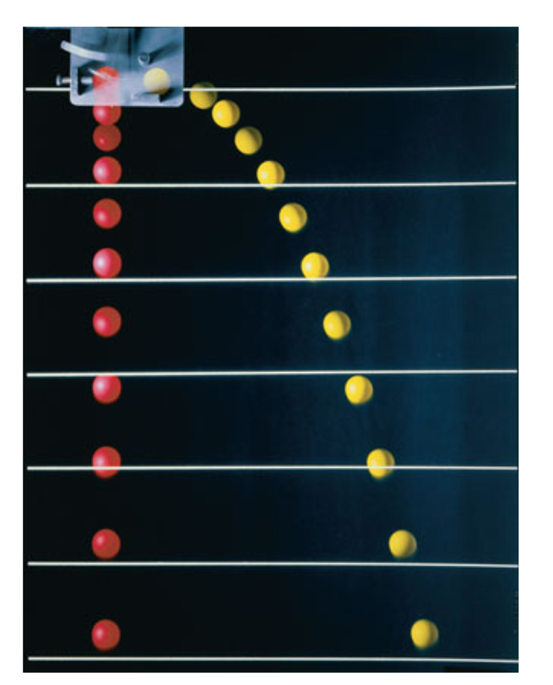

# Projectile Motion
Here we simplify a bit, we ignore the curvature and air resistance.

Here we assume that the acceleration towards earth is constant:

$$
a_y = -g
$$

The vertical and horizontal motions are independent, that means if we throw two balls, one straight to the ground the other with some velocity to the side they booth reach ground at the same time.

Thus we need to trait the x and y coordinate separately.

In projectile motion booth the horizontal and vertical axis wary with constant acceleration. (Horizontal component of acceleration is constant at zero.)