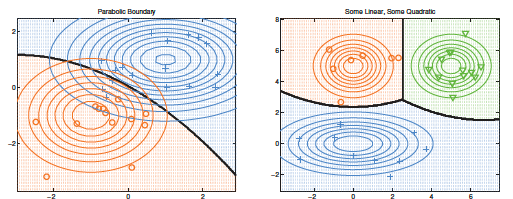

# Quadratic discriminant analysis (QDA)
Can be used for classification where we assume each class is drawn from its [Gaussian distribution](gaussian_distribution.md). This yield an quadratic decision boundary:

$$p(y=c| x, \theta) = \frac{\pi_c |2\pi \Sigma_c|^{-1/2} \exp {[- \frac{1}{2} (x- \mu_c)^T \Sigma^{-1}_c (x-\mu_c) ]}}{\sum_{c'} \pi_{c'} |2\pi \Sigma_{c'}|^{-1/2} \exp {[-\frac{1}{2} (x- \mu_{c'})^T \Sigma^{-1}_{c'} (x-\mu_{c'}) ]}}$$

$$
p(y=c|x, \theta) = \frac{N(x|\mu_c, \Sigma_c)}{\sum_c' N(x|\mu_c, \Sigma_c)}
$$

* $\pi_c$ is the class Prior $\sum_c \pi_c = 1$
* $\mu_c, \Sigma_c$ is the mean and variacne of class $c$$$