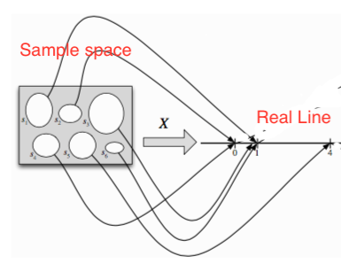

# Random Variables
We can view a random variable as a mapping from the sample space to the real line. 

Mathematically speaking it is a function $X: \Omega \rightarrow R$

## Discrete random variables
Is a random variable that can take up any value from a finite or countably infinite set X.

## Continous random variables
Here X is infinite. Where we can express the probability that a random variable will be between $a < b$ using the CDF:

$$
P(a <  X \le b) = F(b) - F(a)  
$$
