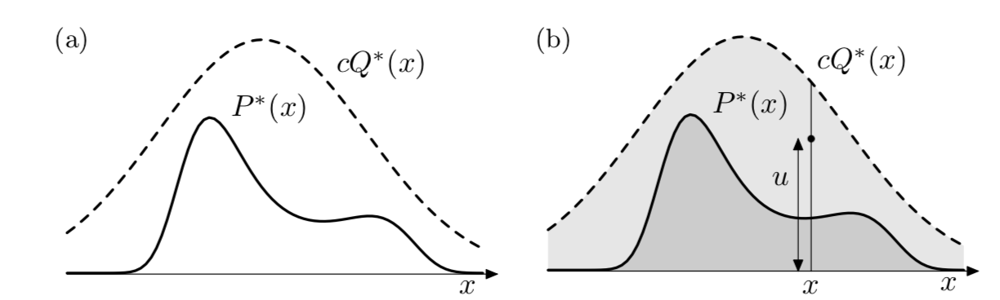

# Rejection sampling

We assume that $P(x) = P^*(x)/Z$ is too compicated to draw samples directly. And we assume we have a simpler proposal density $Q(x)$ which we can evaluate (within a multiplicative factor $Z_Q$), and from which we can draw sammples. Further we assume that we know the value of a constnat c such that:

$$ cQ^{*}(x) > P^*(x) \text{, for all x}$$ 

Afther that we generate a uniformly distributed random variable from the interval $[0, cQ^*(x)]$. Now we compare u to $P^*(x)$.  If $u > P^*(x)$ then we reject x otherwise we accept it.

Rejection sampling works best if Q is a good approximation of P. And we need to choose $c$ to be as small as possible. 

### Remarks 
In high dimensions we have to set $c$ to be large, which will make the acceptance ration rare. Thus it will take ages.