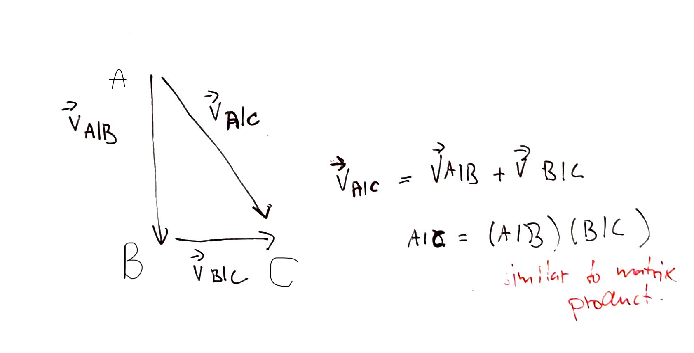

# Relative velocity

Lets assume that we want to know the relative velocity between two objects moving on a plane.

Here object A is moving with respect to object B with velocity $\vec{A|B}$, object C is moving with velocity $\vec{B|C}$. We may ask what is the relative velocity between A and C. Since velocities are vectors it is enough to add them.

$$
\vec{v}_{A|C} = \vec{v}_{A|B} + \vec{v}_{B|C}
$$

If we want to find out the relative speed in which the objects are moving towards/from each other we take the magnitude of the vector:

$$
v_{A|C} = |\vec{v}_{A|C}| = \sqrt{v_{x, A|C}^2 + v_{y,A|C}^2}
$$

The angle is given by:

$$
\phi = \tan^{-1} \frac{opposite}{adjacent}
$$