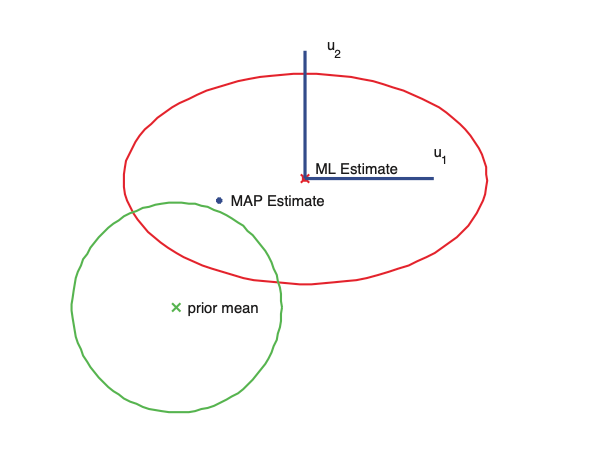

# [Ridge regression](ridge_regression_pca.md) connection to [PCA](principal_component_analysis.md)

We showed that if we perfrom SVD on $X = USV^T$ then we have:

$$\hat{w}_{\text{ridge}} = V(S^2 + \lambda I)^{-1}SU^Ty $$

Our ridge estimation becomes:

$$\hat{y} = X\tilde{w}_{\text{ridge}} = USV^TV(S^2 + \lambda I)^{-1}SU^Ty \\ = U\tilde{S}U^Ty = \sum_{j=1}^d u_j \tilde{S}_{jj}u^T_j y$$

Where:
$$\tilde{S}_{jj} = [S(S^2 + \lambda I)^{-1}S]_{jj} = \frac{\sigma^2_j}{\sigma^2_j + \lambda }$$

* $\sigma_j$ are the scalar values of $X$

Hence:

$$\hat{y} = X\tilde{w}_{\text{ridge}} = \sum_{j=1}^D u_j  \frac{\sigma^2_j}{\sigma^2_j + \lambda } u^T_j y$$

Comparing it to least squares:

$$
\hat{y} = X\tilde{w}_{\text{ols}} = (USV^T)(VS^{-1}U^Ty) = UU^Ty = \sum_{j=1}^D u_ju^T_j y
$$

In the case that $\sigma^2_j$ is small compared to $\lambda$ $u_j$ will **not** have much effect on the prediction. Hence we can say that the direction in which we are most uncertain about $w$, are determied by the eigenvectors of this matrix with the smalles eigen values. Hence a small singular value corresponds to directions with high posterior variance, and in these directions ridge shrinks at the most.

The horizontal $w_1$ parameter is not-well determined by the data (has high posterior variance), but the vertical $w_2$ paremter is well determiined. Hence $w_2^{\text{map}}$ is close to $\hat{w}_2^{\text{mle}}$ but $w_1^{\text{map}}$ is shifted strongly towards the prior mean