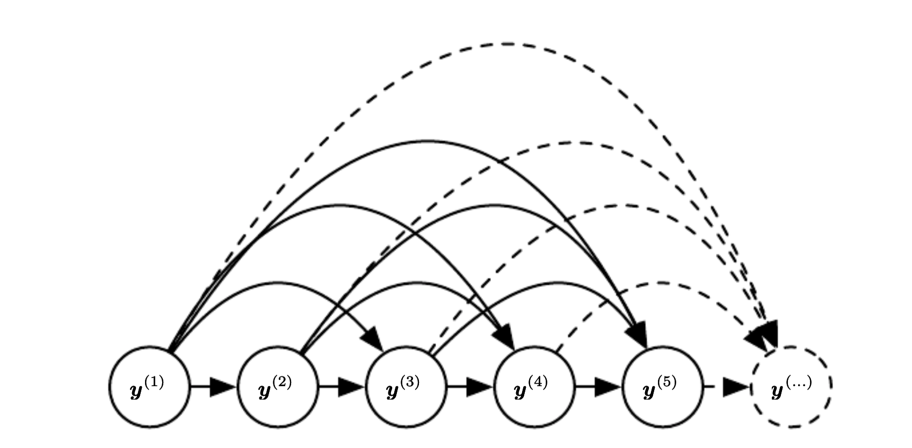
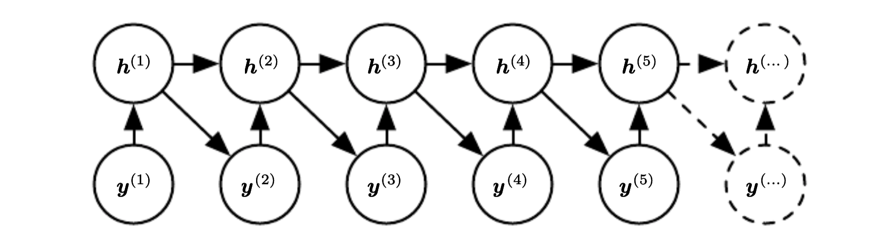

# RNN as a directed graph

If we want to learn the conditional distribution of the next element in the sequence $y^{(t)}$ given the past input:

$$
\log p(y^{(t)}| x^{(1)}, \cdots, x^{(t)}) \\ 
\text{ or } \\
\log p(y^{(t)}| x^{(1)}, \cdots, x^{(t)}, y^{(1)}, \cdots, y^{(t-1)}) 
$$

In RNN we do not make [markov assumption](markov_assumption.md), that the future depends only on the current state, but we say that the future depends on all the previous states.

> Here the hidden state is marginalized out

We can regard hidden units as random variables. 

In this case we can view RNN as an efficient parametrization of the joint distribution over the observations. In general if we have a joint distribution $p(y|x^{(1)}, \cdots, x^{(k)})$ it has $k^T$ possible parameters assuming $x^{(i)}$  has $\tau$ states. If we use RNN there is only one hidden state, because of this the factorization simplifies to:

$$
p(y^{(t)}| h^{(t)})
$$

This dependence only on the hidden state unfortunately makes the optimization more difficult.