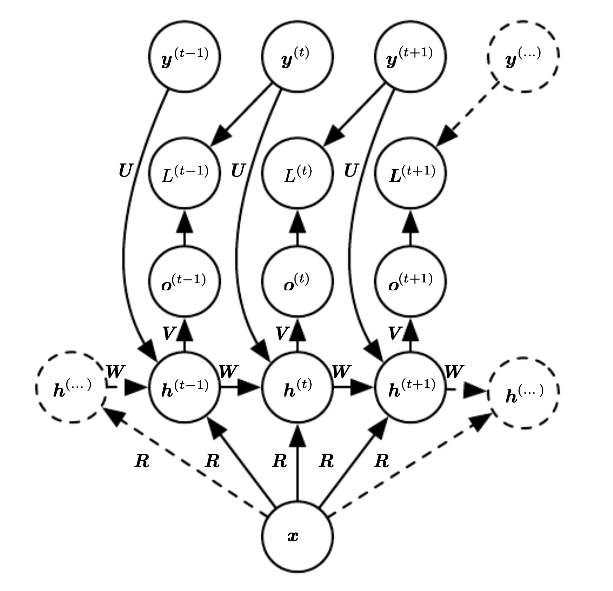
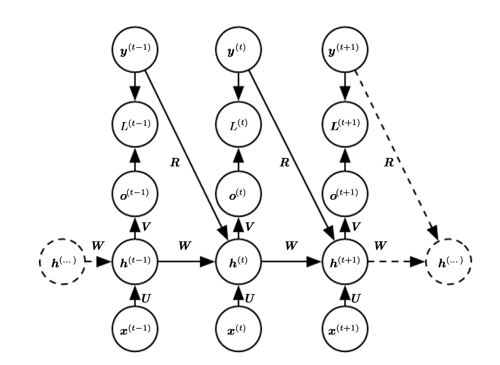

# Recurrent neural networks conditioned on context

In most cases [recurrent neural network](recurrent_neural_networks.md) are not just sequences of random variables $y^{(t)}$ but also include inputs $x^{(1)}, \cdots, x^{(t)}$. Because of this full conditional distribution is of the form:

$$
p(y|\theta(x))
$$

The common way to provide extra input are:

* extra input at each time step
* as the initial state $h^{(0)}$
* boot above

## Extra input at timestep

**The whole vector from the beginning**

There is a single vector $x=(x^{(1)}, \cdots, x^{(t)})$. We map the input using a weight matrix R and it is available at every step.

**Only x^i at step i**

This assumes 

$$
\prod_t p(y^{(t)}| x^{(1)}, \cdots, x^{(t)})
$$

We add a connection from t to the output at time t to the hidden units at $t+1$.