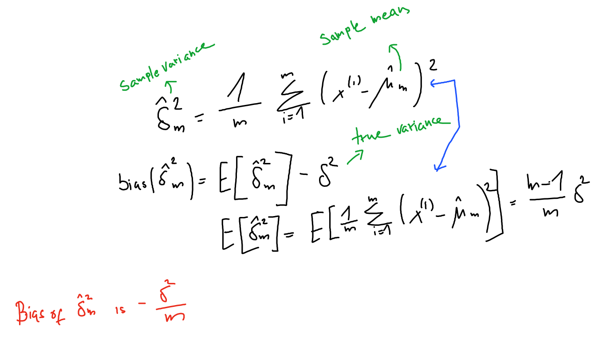

# Sample variance

We define the sample variance as:
$$
\hat{\sigma}^2_m = \frac{1}{m} \sum_{i=1}^m (x^{(i)}  - \hat{\mu}_m)^2
$$

## Bias
The sample variance is a [biased estimator](estimator.md)

$$
\text{bias}(\hat{\delta}^2_m) = - \delta^2/m
$$
* $m$ is the number of samples
* $\delta^2$ is the true variance

If we want an unbiased estimator for variance we have:

$$
\tilde{\delta}^2 = \frac{1}{m-1} \sum_{i=1}^m (x^{(i)}  - \hat{\mu}_m)^2
$$