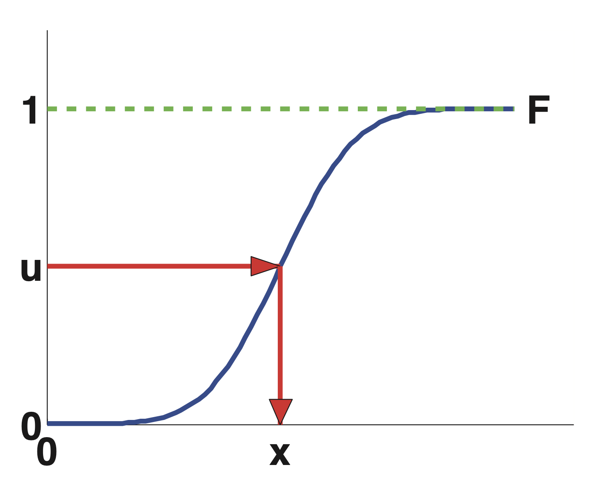

# Sampling from standard distributions

The siplest method to sample from an [uniform distribution](uniform_distribution.md) is based on the **inverse probability transform**. If $F$ is the [CDF](cumulative_distribution_function.md) then if we sample $u \sim U(0,1)$ we can get a random variable by $x = F^{-1}(u)$

## Sampling from a Gaussian

The main idea is that we sample from a unit radius circle, then we use the change of variables formula to derive samples from a spherical 2d Gaussian. 

Sample $z_1, z_2 \in (-1, 1)$, uniformly than discart that do not satistfy $z_1^2 + z_2^2 \le 1$. These points will be uniformly distributed inisde the unit circle.  Then we transform 

$$x_i = z_i (\frac{-2 \ln r^2}{r^2})^{1/2}$$

for $i = 1:2$ where $r^2 = z_1^2 + z_2^2$. Using the multivariate change of variables formula we have:

$$
p(x_1, x_2) = p(z_1, z_2)| \frac{\partial (z_1, z_2)}{\partial (x_1, x_2)}| = [\frac{1}{\sqrt{2}\pi}\exp{(- \frac{1}{2} x^2_1)}][\frac{1}{\sqrt{2}\pi}\exp{(- \frac{1}{2} x^2_2)}]
$$

Henc $x_1$ and $x_2$ are two independent samples form a univariate Gaussian This is known as the **Box-Muller method**
