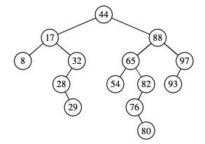
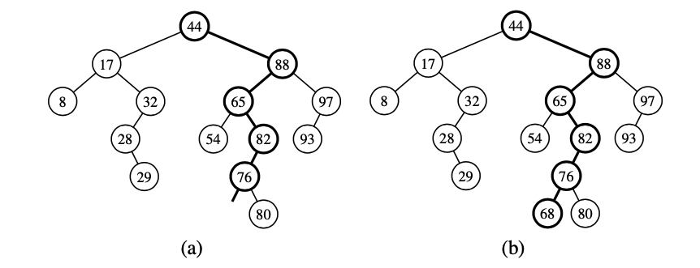

# Search Trees

The basic functionality of a search tree is:

* **M[k]** finding an element by a key, or throwing an error if it does not exists
* **M[k] = v** Associate a value v with key k in map M. (or replace)
* **del M[k]** Remove from map M the item with key equal to k. Raise an error if k is not contained.

## Binary Search Tree

Binary trees are excellent for storing items of a map, assuming that the kays can be ordered. The **binary search tree** satisfies that: 
1. Keys stored in the left subtree of p are less than k
2. Keys stored in the right subtree of p are greater than k



In this tree we can perform an [binary in order traversal](tree_traversals.md), thus we visit each position in increasing order of their keys.

### Searching
Runs in O(h), h is the depth of the search tree.

### Insertion
In case that we find an element we just replace it. If we fail to find the element, the search ends at a leaf. 

```
Algorithm TreeInsert(T, k, v):
    Input: A search key k to be associated with value v
    p = TreeSearch(T,T.root(),k) 
    if k == p.key() then
        Set p’s value to v 
    else if k < p.key() then
        add node with item (k,v) as left child of p 
    else
        add node with item (k,v) as right child of p
```
Here we insert 68 into a search tree:


## [Balanced search trees](balanced_search_trees.md)
The naive search tree provides O(n) worst case performance, thus we turn to a data-structure that has stronger guarantees. In general we need to keep the tree balanced, or to keep its height equal $h=[\log (n+1)] - 1$.