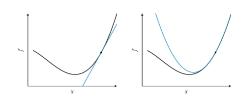
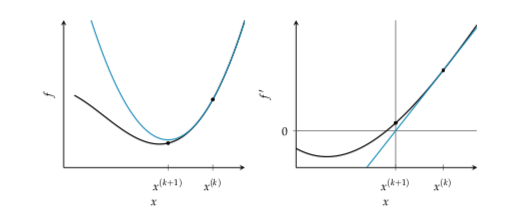
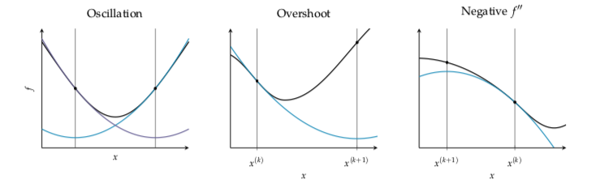

// TODO shorten
# Second order methods
We use the Hessian in the search for the minima.

# Newtons method
The gradient gives us the direction of steepest descent, but it does not tells us how far we should step. Adding second order information allows us to perform an quadratic approximation of the objective function and approximate the right step size to reach a local minimum. Thus we can analytically obtain the location where the quadratic approximation has zero gradient. We use that location as the starting point for the next iteration.



First vs second order approximation. The bell shaped quadratic approximation has a unique location where the derivative is zero.

The basis of this method is to perform a Second Order Taylor Approximation:

$$q(x) = f(x^{(k)}) + (x - x^{(k)})f'(x^{(k)}) + \frac{(x - x^{(k)})^2}{2} f''(x^{(k)})$$

At finding it where the derivative is zero:

$$ \frac{\partial q}{\partial x} = f'(x^{(k)}) + (x-x^{(k)})f''(x^{(k)}) $$

From this we can derive the update rule:
$$ x^{(k+1)} = x^{(k)} - \frac{f'(x^{(k)})}{f''(x^{(k)})}$$



Newtons method can be explained as a root finding method applied to f' that iteratively improves a design point by taking the tangent live at $(x, f'(x))$ finding the intersection with the $x$ axis and use that intersection as a new starting point. 

Newtons method is not applicable when the second derivative is zero. This happens when the quadratic approximation is a horizontal line. Instability also occurs when the second derivative is close to zero, in this case the next iterate will be far from the current design point, far from where the current quadratic approximation is valid.

Some examples when Newtons method fails:



Newtons method tend to converge quickly in a bowl like region that is sufficiently close to a local minima. It has quadratic convergence, that means that the difference between the minimum and the iterate is approximately squared with every iteration. 

Quadratic convergence $x^{(1)}$ within a distance $\delta$ of a root $x^*$ happens if:

* $f''(x) \ne 0$ for all point in $I$
* $f'''(x)$ is continuous on $I$
* $\frac{1}{2}|\frac{f'''(x^1)}{f''(x^1)}| \le c |\frac{f'''(x^*)}{f''(x^*)}|$ for some $c \le \infty$. This condition enforces sufficient closenes, ensuring that the function is sufficiently approximated by a Taylor expansion. And guards against overshooting. 
* $I = [x^* - \delta, x^* + \delta]$

## Multivariate case
$$f \approx f(x^{(k)}) + (g(x^{(k)}))^T (x - x^{(k)}) + \frac{1}{2} (x - x^{(k)})^T H^{-1} (x - x^{(k)})$$

$$\nabla g(x) = g^{(k)} + H^{(k)} (x - x^{(k)}) = 0$$
$$x^{(k+1)} = x^{(k)} - \frac{g^{(k)}}{H^{(k)}}$$

In  case that $f$ is quadratic and the Hessian $H \succ 0$ than Newtons method converges in a single step. 

To increase the robustness of Newtons method we can add a step size and use line search or momentum.

## Algorithm

```
def newtons_method(gradient, hessian, x, epsilon, max_iter):
    k = 1
    delta = np.fill_diagonal(np.Inf, len(x))
    while np.sum(delta * 2) > epsilon and k <= max_iter:
        delta = hessian(x) / gradient(x)
        x -= delta
        k += 1
    return x
```

## As descent direction
Newtons method can be used to supply the descent direction.

$$ d^{(k)} = - (H^{(k)})^{-1} g^{(k)}$$

# Secant method

It applies Newton method using estimates of the Hessian using $\nabla f$. Thus it requires knowing the gradient. 

The secant method uses the last two iterates to approximate the second derivative:

$$f''(x^{(k)}) \approx \frac{f'(x^{(k)}) -f'(x^{(k-1)})}{ x^{(k)} - x^{(k-1)}}$$

We can substitute this into newtons method:

$$ x^{(k+1)} = x^{(k)} - \frac{x^{(k)} - x^{(k-1)}}{ f'(x^{(k)}) - f'(x^{(k-1)})} f'(x^{(k)})$$

The algorithm for secant point requires an additional initial design point. It suffers from the same problems as Newtons method, and it takes longer to converge due to the approximation.


# Quasi Newton
Similarly as the secant method, it approximates the Hessian. To be more specific the Inverse Hessian. The Quasi newton has the from:

$$ x^{(k+1)} = x^{(k)} - \alpha^{(k)} Q^{(k)} g^{(k)}$$

* $\alpha^{(k)}$ is a scalar step 
* $Q^{(k)}$ is the approximation of the inverse hessian at $x$

We start $Q^{(1)} = I$ and at each iteration we update it. There are two main variants:

1. Davidon-Fletcher Powell (DFP)
2. Byorden Fletcher Goldfarb Shanno (BFGS)

Booth algorithms use the following definitions:


$$ \gamma^{(k+1)} = g^{(k+1)} - g^{(k)}$$
$$ \delta^{(k+1)} = x^{(k+1)} - x^{(k)}$$

## Davidon Fletcher Powell

$$Q \leftarrow Q - \frac{Q \gamma \gamma^T Q}{\gamma^T Q \gamma} + \frac{\delta \delta^T}{\delta^T \gamma}$$

* $\gamma = \gamma^{(k)} = g^{(k+1)} - g^{(k)}$
* $\delta = \delta^{(k)} = x^{(k+1)} - x^{(k)}$

This update has the following properties:
1. $Q$ remains symmetric and positive definite
2. If $f(x) = \frac{1}{2}x^TAx + b^Tx + c$ then $Q^{-1} =A^{-1}$. Thus DFP retains the convergence properties of conjugate gradient method.
3. For higher-dimensional problems, storing and updating Q can be significant compared to other methods like conjugate gradient method.


## Byorden Fletcher Goldfarb Shanno (BFGS)

$$ Q \leftarrow Q - \Big( \frac{\delta \gamma^T Q + Q \gamma \delta^T}{\delta^T \gamma} \Big) + \Big( 1 + \frac{\gamma^T Q\gamma}{\delta^T \gamma} \Big) \frac{\delta \delta^T}{\delta^T \gamma} $$

BFGS does better than DFP with approximate line search but it still requires $n\times n$ dense matrix. For very large problems space is a concern. Limited memory BFGS (L-BFGS) can be used to approximate BFGS.

### L-BFGS
Stores only the last m values for $\delta$ and $\gamma$ rather than the full inverse Hessian where $i = 1$ indexes the oldest value and $i=m$ indexes the most recent. The process for computing the descent direction at x begins by computing $q^{(m)} = \nabla f(x)$ the remaining vector $q^{(i)}$ for i from m-1 to 1 are computed using:

$$q^{(i)} = q^{(i=1)} - \frac{(\delta^{(i+1)})^T q^(i+1)}{(\gamma^{(i+1)})^T \delta^{(i+1)}}\gamma^{(i+1)}$$

These vectors are then used to compute an another $m+1$ vectors staring with:

$$ z^{(0)} = \frac{\gamma^{(m)} \odot \delta^{(m)} \odot q^{(m)} }{(\gamma^{(m)})^T \gamma^{(m)}} $$

and proceding with $z^{(i)}$ from i to m according to:

$$z^{(i)} = z^{(i-1)} + \delta^{(i-1)} \Big( \frac{(\delta^{(i-1)})^T q^{(i-1)}}{(\gamma^{(i-1)})^T \delta^{(i+1)}} - \frac{(\gamma^{(i-1)})^T z^{(i-1)}}{(\gamma^{(i-1)})^T \delta^{(i-1)}} \Big)$$

The descent direction is $d = -z^{(m)}$

For minimization the inverse Hessian $Q$ must remain positive definite. The initial Hessian is often set to the diagonal of:

$$
Q^{(1)} = \frac{\gamma^{(1)} (\delta^{(1)})^T}{(\gamma^{(1)})^T \gamma^{(1)}}
$$

Computing the diagonal for the expression above and substituting the result into $z^{(1)} = Q^{(1)} q^{(1)}$ results in $z^{(1)}$

In general Quasi Newton performs well.
