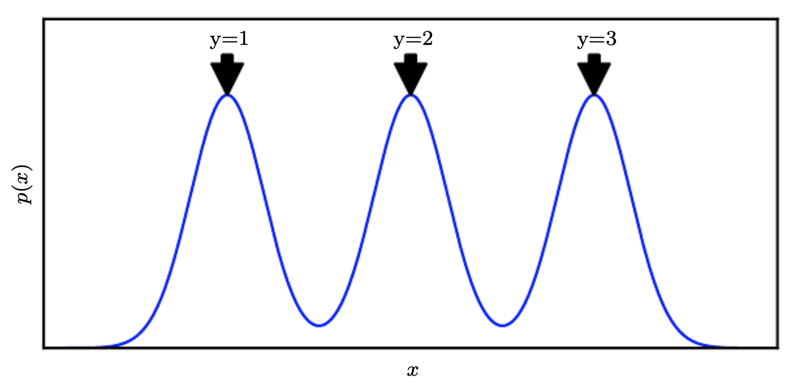

# Semi-Supervised Disentangling of causal factors

* the belief is that the best representation is one where the features within the representation correspond to the underlying causes of hidden data, with separate features or directions of feature space corresponding to different causes, the representation disentanglement the causes from each other

* model that separates the underlying causal factors can be hard to model, but with deep learning it may be come easy to isolate causal factors

## When it will fail

* if learning $p(x)$ is no help to learn $p(y|x)$

## Whe it can succeed
* if x arises from an mixture model:
  
  Here the components are well separated, modeling $p(x)$ reveals where each component is and a single labeled class is enough to perfectly learn $p(y|x)$

* if $y$ is closely associated with one of the causal factors of $x$, then $p(x)$ and $p(y|x)$ will be strongly tied, unsupervised representation learning that tries disentangle the underlying factors of variation is likely to be useful.

* if $y$ is one of the causal factors of $x$ and $h$ represents all these factors. The true generative process can be concieve as structured according to this directed graphical model, with $hy$ as the parent of $x$:
$$
p(x,h) = p(x|x)p(h) \\
p(x) = E_h p(x|h) \space \text{ is the marginal probability}
$$
  * this concludes the best possible model of x is the one that uncovers the above "true" structure, with $h$ as latent variables that explain the observed variations in $x$
  
* most observations are formed by an extremely large number of underlying causes if $y=h_i$, but we do not know which $h_i$, we can learn all $h_i$ but this may not be feasible to capture all (or most) factors
