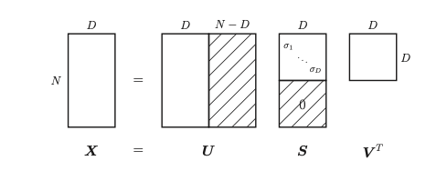

# Singular value decomposition (SVD)

Generalize eigen value decomposition for any matrix. 

$$X = U S V^T$$
›
* $X_{N \times D}$
* $U_{N \times N}$ is orthonormal and is the eigen vectors of $XX^T$
* $S_{N \times D}$ are the singular values where there is only $min(N,D)$ non zero.
* $V_{D \times D}$is orthonormal and it is the eigne vectors of $X^TX$ (This is just the empirical covariance)

In general we do not need to compute all the columns of $U$ since they will be multiplied by zero. **Thin SVD (Economy sized SVD)** avoids computing those.

## Connection between eigen vectors and singular values

Given a matrix $X = USV^T$ we have:

$$
X^TX = VS^TU^TUSV^T = V(S^TS)V^T = VDV^T 
$$
* $D = S^2$ contains the square singular values

Hence
$$
(X^TX) V = VD
$$

That makes $V$ the eigen vectors of $X^TX$, the right singular vectors of X, and $D$ are its eigen values.

Similarly:

$$
XX^T = USV^TVS^TU^T = U(SS^T)U^T \\
(XX^T)U = U(SS^T) = UD
$$

This makes $U$ the eigen vectors of U, and the left singular vectors of X

There is a special variant of SVD called **truncated SVD** which computes only the first L singular values. And gives the option to perform an rank L low rank approximation. 

