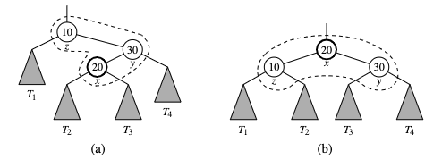

# Splay trees

Are [balanced binary search trees](balanced_search_trees.md). There is no strict enforce a logarithmic upper bound on the height of the tree. Instead, we perform certain move-to-root operations called splaying, which is performed at the bottom-most position p during every insertion, deletion, and search. This results that more frequently accessed elements remain at the root, and reducing search time. It allows us to guarantee a logarithmic amortized running time, for insertions, deletions, and searches. 

## Splaying
Given a node x of a binary search tree T, we **splay** x by moving x to the root of T through a sequence of restructurings. The specific operations we perform to move x up depends upon the relative positions of x, its parent y, and x's grandparent z (if exists). We consider the following cases

### zig-zig
The node x and its parent y are both left children or booth, right children. We promote x, making y a child of x and z a child of y, while maintaining the inorder relationship of nodes in T.

### zig-zag 

One of x and y is left child and the other is a right child. In this case we promote x by making x have y and z as its children, while maintaining the inorder relationships of the nodes in T.

   
### zig 

X does not have a grandparent. In this case, we perform a single rotation to promote x over y, making y a child of x, while maintaining inorder relationship of the nodes in T.

A **splay step** consists of repeating these restructurings at x until x becomes the root of T, 

## Rules when to splay
* When searching for a key k, if k is found at position p, we splay p, else we splay the leaf position at which the search terminates unsuccessfully. 
* When inserting a key k, we splay the newly created internal node where k gets inserted. Example of growing a new tree:
  

* When deleting a key k, we splay the position p, that is the parent of the removed node
  
