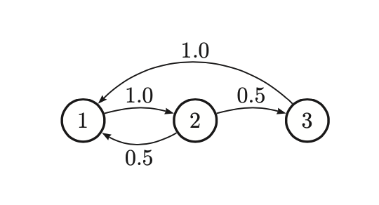

# Stationary distribution
It is the long terms distribuion over states or a [Markov Chain](markov_models.md)

Let $A_{ij} = P(X_t = j | X_{t-1}= i)$ be the one-step transition matrix, and let $\pi_t (j) = p(X_t = j)$ be the probability of being in state j at time t. At time $t=1$:

$$\pi_1 = \pi_0 A$$
* $\pi_0$ initial distribution

If we reach a stage that:

$$\pi = \pi A$$

then we say we have reached the stationary distribution. Once we enter the stationary distribution, we will never leave. 

If we are in a stationary distribution we automatically satisfy the **global balance equations**.

Global balance equations states that:

> Probability of being in state i times the net flow out of state i must equal the probability of being in each other state j times the net flow from that state into i.*

$$
\pi_i \sum_{j\ne i}A_{ij} = \sum_{j \ne i}\pi_jA_{ji}
$$

## Computing stationary distribution

To find the stationary distribution, we can just solve the eigenvector equation $A^Tv = v$, and set $\pi = (\frac{v}{||v||})^T$, where $v$ is the eigen vector with eigen value 1. 

Unfortunately this can handle **only matrices which are positive** $A_{ij} > 0$. A more general approach is to handle chains where some transition probabilities are 0 or 1. 

We have K contraints from $\pi (I - A)= 0_{K \times 1}$ and 1 contraint of the form $\pi 1_{K \times 1} = 0$. Since we have K unknown, this is overconstrained. So we can replace any column of $I-A$ with 1, to get a new matrix M. Next we define $r = [0, 0, \cdots, 1]$ where the 1 in the last position corresponds to the column of all 1ns in M. Then we just solve $\pi M = r$

For the following chain:

We get to solve:

$$
\begin{pmatrix} \pi_1 & \pi_2 & \pi_3 \end{pmatrix} 
\begin{pmatrix}
    1 - A_{11} & -A_{12} & 1 \\
    -A_{21} & 1 - A_{22} & 1 \\
    - A_{31} & - A_{32} & 1
\end{pmatrix} = 
\begin{pmatrix} 0 & 0 & 1\end{pmatrix}
$$

The solution is $\pi = [0.4, 0.4, 0.2]$

## When does the stationary distribution exists

Not all chains have a stationary distribution. 

A necessary condition to have a unique stationary distribution is that the state transition diagram be a singly connected component, i.e., we can get from any state to any other state. Such chains are called irreducible.

We also require that we end up in the same stationary distribution no matter where we start. Hence we say that:

A chain has a limiting distribution if $\pi_j \lim_{n \rightarrow \infty} A_{ij}^n$ exists and is independent of $i$, for all $j$. If this holds then the long-run distribution over states will be indepdent of the starting state:

$$
P(X_t = j) = \sum_t P(X_0 = i)A_{ij}(t) \rightarrow \pi_t \\
t \rightarrow \infty
$$

Hence we require the chain to be apperiodic, which is only if all the states in the chain are aperiodic. (There is no closed loop we cannot escape.)

**Theorem**:

> Every irreducible (singly connected), aperiodic finite state Markov chain has a limiting distribution, which is equal to $\pi$, its unique stationary distribution.

For a Markov chain with infinite number of states, our requirements are similar.

We require that each state is recurrent, and we can return to that position in finite time. The two requirements combined is also called **non-null recurrent**. 

We can say that a state is **ergodic** if it is aperiodic, recurrent and non-null, and we can say that a chain is ergodic if all its states are ergodic. 

**Theorem**

> Every irreducible (singly connected), ergodic Markov chain has a limiting distribution, which is equal to $\pi$, its unique stationary distribution.

## Detailed balance equation

Establishing ergodicity can be difficult. There is an alternative condition that is easier to verify.

We say that a Markov chain A is **time reversible** if there exists a distribution $\pi$ such that:

$$\pi_i A_{ij} = \pi_j A_{ji}$$

These are called the **detailed balance equations**. This says that the flow from i to j must equal the flow from j to i, weighted by the appropriate source probabilities.

**Theorem**

> If a Markov chain with transition matrix A is regular and satisfies detailed balance wrt distribution $\pi$, then π is a stationary distribution of the chain.