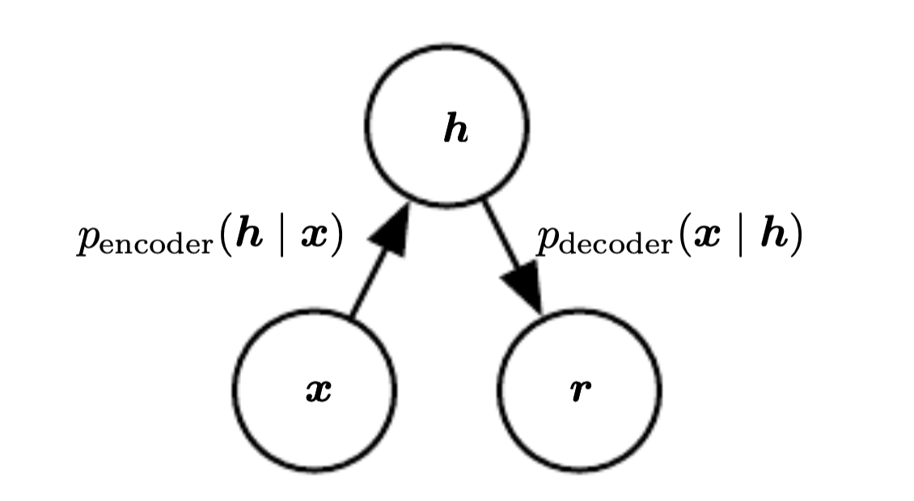

# Stochastic Encoder and Decoders

An [autoencoder](autoencoder.md) $x$ where the encoder and decoder is defined in therms of an latent variable model:

$$
p_{\text{encoder}}(h|x) = p_{\text{model}}(h|x) \\
p_{\text{decoder}}(x|h) = p_{\text{model}}(x|h) 
$$

* $p_{\text{model}}(h,x)$ is the latent variable model

