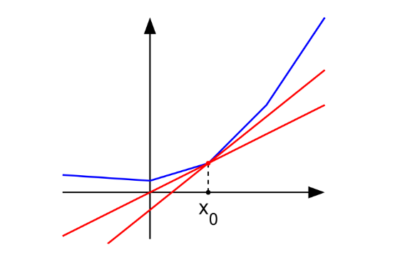

# Subgradient

Subgradients are generalization of gradients. Which is applicable for nondifferentiable functions. 

Couple of facts:

* For convex functions they allways exists
* They may exists at points where functions are not differentiable
* If a function is differentaible than the subgradient is just the gradient

## Definition

For convex differentiable functions we have:

$f(y) \ge f(x) + \nabla f(x)(y-x)$ for all $x,y$ (This actually tells us that, if we approximate the function at any point using a linear approximation ($f(x) + \nabla f(x)(y-x)$ intercept + slope), we always uderestimate the true value, except at x. 

From this we define the subgradient, as a generalization of gradient, with the property:

Let $g \in R^n$ be a subgradient of a convex function f at x such that:

$f(y) \ge f(x) + g^T (y - x)$

The red lines are subgradients. They allways underestimate.