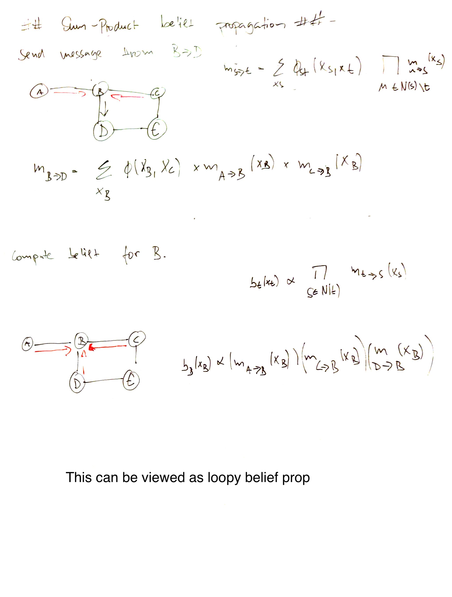

# Sum-product message passing
It is an variant of [belief propagation](belief_propagation.md) used to compute marginals.

## Algorithm
While there is a node $x_i$ ready to transmit to $x_j$ it sends the message:

$$
m_{i \rightarrow j}(x_j) = \sum_{x_i} [\phi(x_i)\phi(x_i,x_j) \prod_{l \in N(i)\backslash j} m_{l\rightarrow i}(x_i)]
$$

* $N(i)\backslash j$ set of nodes that are neighbors of i excluding j.

This message is just the factor $\tau$ that $x_i$ would transmit to $x_j$ during variable elimination if the goal would be computing $p(x_j)$.

We can use the computed messages to answer any marginal query over $x_i$:

$$
p(x_i) \propto \phi(x_i) \prod_{l \in N(i)} m_{l \rightarrow i} (x_i)
$$

## Example

## Serial protocol

## Algorithm for factor trees

We apply message passing to factor trees. In [factor graphs](factor_graph.md) we have two type of messages. 
* variable-to-factor message $v$
* factor-to-variable message $\mu$ 

$$
v_{\text{var}(i)\rightarrow \text{fac}(s)}(x_i) = \prod_{t \in N(i)\backslash s} \mu_{\text{fac}(t) \rightarrow \text{var}(i)}(x_i) \\
\mu_{\text{fac}(s) \rightarrow \text{var}(i)}(x_i) = \sum_{x_{N(s)\backslash i}}f_s(x_{N(s)}) \prod_{j \in N(s)\backslash i} v_{\text{var}(j) \rightarrow \text{fac}(s)}(x_j)
$$

