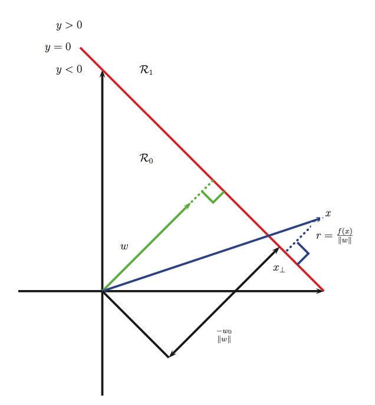
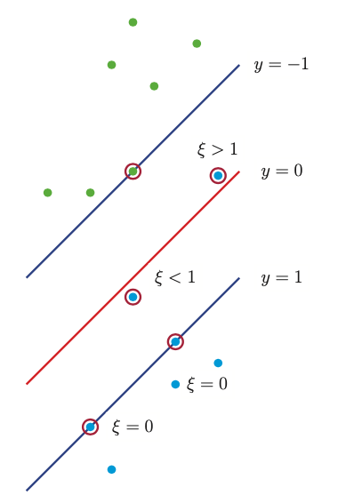

# Large margin principle

We can view [SVM classification](svm_classification.md) from a different perspective.

Our Goal is to derive an discriminant function $f(x)$ which is linear in the feature space implied by the choice of kernel. 

If we consider a point x in this induced space, we see that:

$$
x = x_{\perp} + r \frac{w}{||w||}
$$

* $r$ is the distance of x from the decision boundary whose normal vector is w
* $x_{\perp}$ is the orthogonal projection of x onto the boundary 

Hence:

$$
f(x) = w^Tx + w_0 = (w^Tx_{\perp} + w_0) + r \frac{w^Tw}{||w||}
$$

Now $f(x_{\perp}) = 0$ so $0 = w^T{x_{\perp}} + w_0$. Hence $f(x) = r \frac{w^Tw}{\sqrt{w^Tw}}$ and $r = \frac{f(x)}{||w||}$.

We want to make the distance $r = \frac{f(x)}{||w||}$ as large as possible. In particular, there might be many lines that perfectly separate the training data (especially if we work in a high dimensional feature space), but intuitively, the best one to pick is the one that maximizes the margin, i.e., the perpendicular distance to the closest point. And we want to ensure that each point is on the correct side of the boundarym hence we want $f(x_i)y_i > 0$. 

So our objective becomes:

$$
\max_{w, w_0} \min_{i=1}^N \frac{y_i(w^Tx_i + w_0)}{||w||}
$$

By rescaling the parameters using 

$$
w \rightarrow kw \\
w_0 \rightarrow kw_0
$$
We do not change the distance of any point to the bondary since the factor k cacnel out when divided by $||w||$. Therefore we can define the scale factor $y_if_i = 1$ for the point that is closes to the decison boundary. Our optimization problem becomes:

$$
\min_{w, w_0} \frac{1}{2}||w||^2 \\
\text{ s.t } \\
y_i(w^Tx_i + w_0) \ge 1, i = 1:N
$$

The constraint says that we want all points to be on the correct side of the decision boundary with a margin of at least 1. For this reason, we say that an SVM is an example of a **large margin classifier**. 

Unfortunatelly this optimization problem does not allow missclassification, and if the data is not linearly separable there will be no feasible solutions. To get arround this problem, we can again introduce slack variables $\xi_i \ge 0$  such that $\xi_i =0$ if the point is inside the correct margin, $\xi_i = |y_i - f_i|$ otherwise. If $0 < \xi_i \le 1$ the point lines inside the margin, but on the correct side of the decision boundary. If $\xi_i > 1$ the point lies on the wrong side of the decision boundary.

We replace hard constraints $y_if_i \ge 0$ with **soft margin constraints** $y_if_i \ge 1 - \xi_i$ the objective becomes:

$$
\min_{w, w_0, \xi} \frac{1}{2}||w||^2 + C\sum_{i=1}^N\xi_i \\ 
\text{ s.t } \\
\xi_i \ge 0 \\
y_i(x^T_iw + w_0) \ge 1 - \xi_i
$$

Thus we arrived at the original equation.