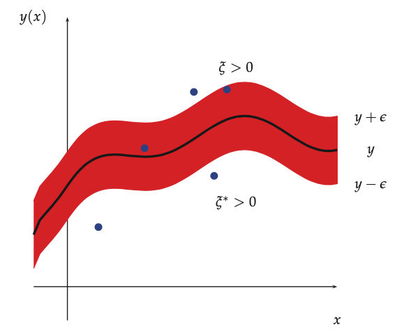

## [SVM](support_vector_machines.md) for regression.
The problem with [kernelized ridge regression](kernel_trick.md) is that the solution vector w depends on all the training inputs. We now seek a method to produce a sparse estimate. We use a variant of **Hubert loss** function called the **epsilon insensitive loss function** defined as:

$$
L_{\epsilon}(y, \hat{y}) = \begin{cases}
    0 & \text{ if } |y - \hat{y}| < \epsilon \\
    | y - \hat{y}| - \epsilon & \text{ otherwise}
\end{cases}
$$

This means that any point lying inside an  $\epsilon$-tube  around the prediction is not penalized

Our loss function is of the form:

$$
J = C \sum_{i=1}^N L_{\epsilon}(y_i - \hat{y}_i) + \frac{1}{2}||w||^2
$$

* $\hat{y}_i = f(x_i) = w^Tx_i + w_0$
* $C = 1/\lambda$ (regularization constant)

This objective is convex and uncontrained, but it is not differentiable, because of the absolute value function in the loss term. The get arround this problem we reformulate this as a contrained optimization problem, by introducing **slack variables** to represent the degree to which each point lies outside the tube.

$$
y_i \le f(x_i) + \epsilon + \xi_i^+ \\
y_i \ge f(x_i) - \epsilon - \xi_i^-
$$

We can rewrite the objective as:

$$
J = C \sum_{i=1}^N (\xi_i^+ + \xi_i^-) + \frac{1}{2}||w||^2
$$

This is a quadratic function of w, and must be minimized subject to the linear constraints, as well as the positivity constraints $\xi_i^+ \ge 0$and $\xi_i^- \ge 0$, hence this is a **quadratic program**. 

$$
\min_w C \sum_{i=1}^N (\xi_i^+ + \xi_i^-) + \frac{1}{2}||w||^2 \\
\text{s.t} \\
y_i \le f(x_i) + \epsilon + \xi_i^+ \\
-y_i \le - f(x_i) + \epsilon + \xi_i^- \\
\xi_i^+ \ge, \xi_i^- \ge 0
$$

Where the optimal solution has a form:

$$
\hat{w} = \sum_i \alpha_ix_i
$$

* $\alpha_i \ge 0$

The vector $\alpha$ is sparse, since we do not care about errors which are smaller than $\epsilon$. Values of $x_i$ for which $\alpha_i \ge 0$ are called **support vectors**, those are the points for which the errors lie on or outsie the $\epsilon$ tube. 

To make predictions we can use the trained model as:

$$
    \hat{y}(x) = \hat{w}_0 + \hat{w}^T x \\
    \hat{y}(x) = \hat{w}_0 +\sum_i \alpha_i x_i^T x \\
    \hat{y}(x) = \hat{w}_0 +\sum_i \alpha_i k(x_i, x)
$$

Hence we get a kernelized solution. 
