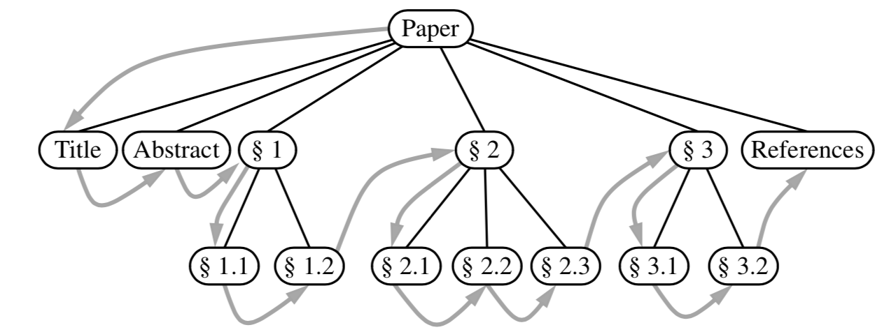
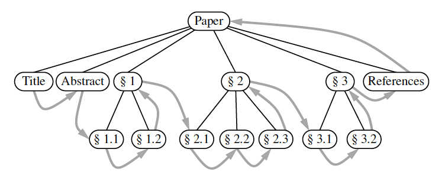
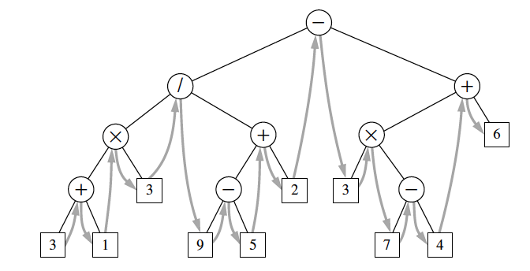
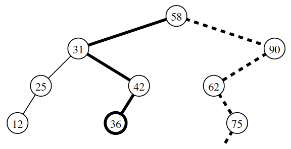
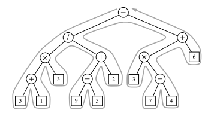

# Tree traversal algorithms

It is a systematic way of accessing, visiting all the position of a tree T.

## Pre order traversal
The root of T is visited first and then the subtrees rooted at its children are traversed recursively. If the tree is ordered, then the subtrees are traversed according to the order of the children. 

```
Algorithm preorder(T, p):
	perform the “visit” action 
	for position p for each child c in T.children(p) do
		preorder(T, c)
```



Runs in O(n)

## Post order traversal
It can be viewed as the opposite of the pre order traversal. It recursively traverses the subtree rooted at the children of the root first and then visits the root. 

```
Algorithm postorder(T, p):
	for each child c in T.children(p) do
		postorder(T, c) 
	perform the “visit” action for position p
```



Runs in O(n)

## Bread first Tree traversal

We first visit each element at depth d, before we visit elements at position at depth d+1. This is typical for games, we may explore all the possible moves 1 move in the future, 2 moves in the future and so on. This is an optimization since we cannot travel depth first since there is exponentially many moves.

```
Algorithm breadthfirst(T):
	Initialize queue Q to contain T.root( )
	while Q not empty do
		p = Q.dequeue() {p is the oldest entry in the queue} 
		perform the “visit” action for position p
		for each child c in T.children(p) do
			Q.enqueue(c) {add p’s children to the end of the
```


## Inorder Traversal of Binary Tree

This is an algorithm specially for a binary tree. During an inorder traversal, we visit a position between the recursive traversals of its left and right subtrees. We can say that we go from left to right. 

```
Algorithm inorder(p):
	if p has a left child lc then
		inorder(lc) {recursively traverse the left subtree of p} 
	perform the “visit” action for position p
	if p has a right child rc then
		inorder(rc)
```




## Binary inorder tree traversal
This is a specially case of in order traversal when we have an ordered sequence in a binary tree. This structure has the name binary search tree. Let S be a set whose unique elements have an order relation. For example, S could be a set of integer. A binary search tree for S is a binary tree T such tat for each position p of T:

*  Position p stores an element of S, denoted as e(p)
*  Elements stored in the left subtree of p (if any) are less than e(p).
*  Elements stored in the right subtree of p (if any) are greater than e(p).




## Eulers tour traversal
The Euler tour traversal of a general tree T can be informally defined as a "walk" around T,where we start by going from the root toward its leftmost child, viewing the edges of T as being "walls" that we always keep to our left.



The time complexity is $O(n)$ since we visit each node exactly two times. Here we can unify the notion of preorder and postorder traversal into:
* "pre visit" occurs when we first reach the position
* "post visit" when we proceed upward from that position

```
Algorithm eulertour(T, p):
	perform the “pre visit” action for position p
	for each child c in T.children(p) do
		eulertour(T, c) //recursion for each subtree
	perform the “post visit” action for position p
```
